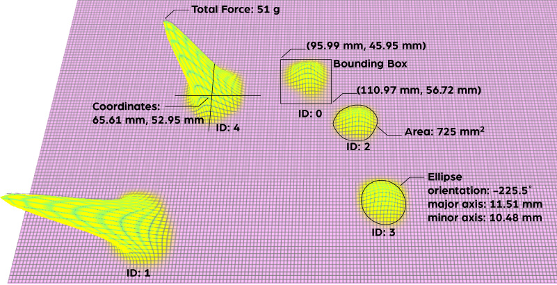

## How the Sensor Works

If you want to use the API to create your own programs that interact with a Sensel pressure sensor, it’s important to have a basic understanding of how the sensor detects gestures, how it interprets the data, and how your computer gets information from the sensor.

#### The sensels

A Sensel device is made up of a grid of individual pressure sensors, or _sensels_. In the case of the Morph, the high resolution sensor is made of a grid of 185 columns x 105 rows of sensels. When a contact is made, several sensels are activated, with each having its own pressure reading, combined to generate touch events. 

#### The force image

Similar to a monitor’s pixels or a camera’s CCD, the varying levels of pressure sensels form an image. This matrix of values is buffered on the device’s microprocessor, waiting for retrieval from a computer.

#### Contacts

But wait, there’s more! The microprocessor also analyzes the image using computer vision techniques to identify individual touches, the force of each individual touch, the size, and more. You don’t need to process the raw data, you just need to fetch it from each frame using the API.

#### Polling

Every frame must be requested to get information about the contacts. This makes the API flexible for different uses and computers.

## About the API

The Sensel API is used to get inside all the contact and pressure information from the sensor. Unlike the predefined functions of the overlays, using the API lets you define the interaction and innovate with the uniquely sensitive pressure technology underneath the unassuming black plastic.

### Installation

The API files and examples are available at the Sensel [github site](https://github.com/sensel/sensel-api). The `sensel-install` directory contains installers for Windows, Mac and Linux that places Sensel libraries and headers into the appropriate directory for each operating system. The README has terse details about the API, including installation details. This guide is designed to help you understand what the API provides, and how the sensor works to get pressure data to your computer.

### Details
This guide also documents all the [API calls](sensel_h/) and force-frame decompression [API calls](sensel_decompress_h/)

### Examples

The Sensel API [repository](https://github.com/sensel/sensel-api) has several basic examples to get you started and help you figure out the best way to get the data you need. The API has libraries suitable for development in C, C#, and Python. The examples are designed to print output to the console, to give you immediate feedback on what is happening.

Each language’s example also gives you a template for what to include in the headers and where to put any files that need to be imported into your main program. They also provide standard routines for fetching a frame, getting information about the frame, getting raw frame data if needed, and getting contact information within each frame. 

- example_1_hello_sensel - Uses the `getSensorInfo` call to retrieve and print out some basic information about the sensor. No interaction required, just run the example. 
- example_2_sensel_contacts - Shows how to retrieve data about contacts and the encompassing frame. This example fetches 500 frames before ending. 
- Example_3_sensel_forces - A simple example of fetching the force image and doing something with it. Scans the force array of the frame and sums all forces on every sensel in the sensor and prints the result to the console.  

#### Teach A Coder To Fish

These elementary examples may seem to lead to more questions than they answer. The truth is that they lead to more interesting and productive questions! For example, you might think of example 2 “Ok, I see the contact ID, but I need more information! Where is that ID? How hard is the press? What else can I know?”

It is more worthwhile to point you to the best place to find these answers: in the language’s accompanying includes:

- C: [sensel.h](https://github.com/sensel/sensel-api/blob/master/sensel-lib/src/sensel.h) 
- C#: [Sensel.cs](https://github.com/sensel/sensel-api/blob/master/sensel-lib-wrappers/sensel-lib-cs/Sensel.cs) 
- Python: [sensel.py](https://github.com/sensel/sensel-api/blob/master/sensel-lib-wrappers/sensel-lib-python/sensel.py) 
  
In the case of the C# and Python examples, these files are located in the same directory as the examples themselves. The C header file is in the repo’s `sensel-lib/src` directory.

Reading through these files, you’ll quickly find what information is available. For example, in sensel.py, you’ll find the Contact class that shows all the possible properties of a contact. Here’s an excerpt:

```

class SenselContact(Structure):

    _fields_ = [("content_bit_mask", c_ubyte), 

                ("id", c_ubyte), 

                ("state", c_int), 

                ("x_pos", c_float), 

                ("y_pos", c_float), 

                ("total_force", c_float), 

```

As you’ll notice in example 2, the script gets the ID from `frame.contacts[n].id`. After looking at the Contacts class, It is logical to assume you can get the coordinates from `frame.contacts[n].x_pos` and `frame.contacts[n].y_pos`. The next section “API Data Output Description” describes all the possible outputs from a frame and contacts.

You can also quickly get all the defined constants from the include files. In particular, the various MASK values are often referenced, and the include clearly defines those at the top of the include file.

Finally, it is worth investigating the include files to learn about all the functions that could be used to build out the examples into something substantial and see how the contacts data is accessed. 

### Force Frame Decompression

There is a separate library that is used to decompress the Force Frame. This library is optional, and is used to access to the underlying force image. The library takes the compressed force and label arrays sent from the device and decompresses them into easy to access force and label images.

## API Data Output Description

Now that you have the API and the libraries installed, and you’ve run the examples and gotten some data, you probably have the question “What does it all mean?” `

There are two structures of data you will be concerned with from the sensor: frame and contact. 

Frame provides information about the entire surface at a given time, such as the array of contacts, number of contacts, the forces array, accelerometer data, lost frames, and more.

Contact describes parameters associated with an individual touch on the surface within any frame: where, how much pressure, how big of a touch, the orientation, etc. Contact information is what most developers will be interested in. Researchers and programmers looking to extend Contact data will find the Frame Data useful.



This guide describes all the possible output from polling the sensor with the API.  

### Frame Data

Frame data is reported every time a frame is requested, within the limits of the scanning rates. Each frame reports the Contact Data (described in the next section) and some additional data described below.

#### Contact Array

The contact array contains all the data about all the touches. Details about each touch are explained in the Contact Data section.

#### Number of Contacts

A single integer reporting the number of active contacts, or contacts with the state `start`.

#### Accelerometer

- Value range: 0-1 
- Units: Gs 

If the device is equipped with an accelerometer, raw accelerometer data can tell you the orientation of the device. A three item list `accel_data` reports the force of gravity on each axis [x, y, and z]. The Morph is equipped with an accelerometer.

#### Force Array

- Value range: 0-8192 
- Units: grams 

The force array reports a 2D array of all the force readings for every sensel (force sensor) on the device. The resolution of this array matches the row/column count reported by the device. In the case of the Morph, this is a 185x105 matrix. You can use the SenselApp Visualizer to get an idea of what the output “looks” like. This is the raw pressure image of all contacts, and would require additional image processing or machine learning algorithms to be useful.

#### Labels Array

- Value range: 0-16 
- Units: n/a 

The labels array is a 2D array of row/column elements that describe contact blobs with the assigned IDs.  The Labels can be used to associate contact tracking with the force array. The Labels array tells you the ID at every sensel on the device in any frame. An ID of `255` is the *null* ID.

#### Lost Frame Count

The Lost Frame count reports the difference between the frames scanned by the sensor and the frames retrieved by the API. This can be helpful in diagnosing problems and optimizing your program.

#### Content Bitmask

The Content Bitmask is used to enable or disable reporting of the five (5) parameters in Frame Data: Contacts, Force Array, Labels Array, Accelerometer Data, and Lost Frame Count. Set the byte value according to the parameters needed. For example, a value of “12” (01100) would report Labels Array and Accelerometer Data. 

### Contact Data

A Sensel sensor can sense 1 to 16 fingers (or styli) and will report the following information for each “touch”.

By default, ID, Coordinates, State, Total Force, and Area are reported. The additional contact parameters Ellipse, Deltas, Bounding Box, and Peak Force can be reported according to the four bit value of the Set Contact Bitmask.

Values (except state) are retrieved as individual floating point or integer numbers. For example, the ellipse is not reported as an array from fetching the `ellipse` property resulting in `[area, orientation, major axis, minor axis]`, but as individual contact properties for each parameter.

#### ID

- Value range: 0 - 15 

ID is assigned per contact, unique for the duration of the contact. For example if you put your index finger down, the contact will be assigned ID 0. Adding a thumb gives that contact ID 1. The API does not assign IDs based on finger or persistence beyond the duration of a contact. For example, the index finger is not always assigned ID 0. IDs are assigned sequentially and recycled when contacts are released.

#### Coordinates

- Value range: 0 - 240, 0 - 139 
- Units: millimeters 

Coordinates are retrieved from separate nodes `x_pos` and `y_pos` for horizontal and vertical coordinates. The origin is the top left of the device. Y is positive down, X is positive to the right.

#### State

- Values: `start`, `move`, `end` 

When contact is made, the state is reported as `start`. If the contact coordinates change, state changes to `move.` When the contact is broken, it is reported as `end.` Every contact is guaranteed a `start` and `end` state. The `move` state is not guaranteed, as contacts may happen too rapidly for the scanning rate to reliably report a `move.`

#### Total Force

- Value range: 0 - 8192 
- Units: grams 

Force is measured in grams, and is a calibrated value for consistency among units. However, it is not suitable for commerce!

#### Area

- Value range: 0 - 33360  
- Units: square mm 

Area reports the size of the contact, as measured by the activity on each sensel of the sensor.

#### Ellipse

- Value Range: 0 - 360 
- Units: degrees, mm 

Three values are reported to describe the approximate ellipse of the contact. The angle of orientation, major axis length, and minor axis length. The angle range can report values outside the 360 degree range to prevent discontinuities; if a contact is rotated past a full turn, the value will increase past 360 degrees allowing for detection of rotation past a full turn (this is somewhat of an edge case).

#### Deltas

- Value Range: 0 - 240, 0 - 139, 0-8192, 0 - 33360 
- Units: mm, grams, square mm 

Deltas reports changes of coordinates, force, and area between frames. These are reported as values ∆x, ∆y, ∆-force, ∆-area. The deltas could be calculated from other incoming data, but this is a convenient way to access this information.

#### Bounding Box

- Value range: 
- Units: mm 

The rectangle that contains the contact area is can be retrieved from four properties, using the top-left and bottom-right corner coordinates of the bounding box. You’ll find the properties `min_x`, `min_y`, `max_x`, `max_y` in contacts.

#### Peak Force

- Value range: 0 - 1000 
- Units: grams, mm 

The highest detected force value in the contact area has the property `peak_force`, along with the coordinates where that force occurred, `peak_x` and `peak_y`.

#### Set Contact Bitmask

This API call will allow the optional parameters to be reported. It’s a single value represented by four (4) bits for each parameter: Ellipse, Deltas, Box, and Peak Force. For example, if you want to see just the Ellipse data reported with the standard data, you’d set the bitmask value to “8” corresponding to the bit pattern [1000]. Ellipse and Deltas would have the value “12” (1100). All optional data would be “0F” (1111).
