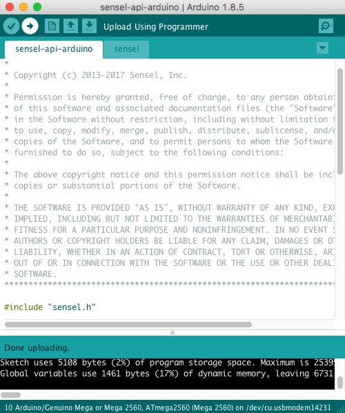

# Using the Morph Developer's Cable and Arduino

The Morph Developer's Cable is a simple accessory that connects the Morph's micro USB to the serial UART pins of an Arduino MEGA microcontroller. This simple connection allows developers to develop prototypes of products that do not depend on a fully featured computer, but instead run on a simple microcontroller and basic power supply.

## Getting Started 

You'll need at least a few things on hand to start experimenting with the Arduino API.

### Hardware:

* [Morph](https://sensel.com/products/the-sensel-morph)
* [Morph Developer's Cable](https://sensel.com/collections/all/products/developers-cable)
* [Arduino MEGA](https://store.arduino.cc/usa/arduino-mega-2560-rev3) or [DUE](https://store.arduino.cc/usa/arduino-due)
* [USB Printer (A/B) Cable](https://www.monoprice.com/product?p_id=5438)
* [Power Supply](https://playground.arduino.cc/Learning/WhatAdapter) *optional*

#### Hardware Connections

It is <span style="color:red;font-weight:800;font-size:18px">VERY IMPORTANT TO CHECK YOUR CONNECTIONS</span>. If you make a mistake and connect Ardunio power to the Morph's Serial connections, <span style="color:red;font-weight:800;font-size:18px">YOU MAY DAMAGE YOUR MORPH</span> beyond repair.


Your basic connections for developing with the Arduino IDE and the Sensel Morph are as follows:

* USB Printer Cable connects your computer to the Arduino's USB B port
* Developer Cable USB micro to Morph
* On Developer Cable: Black, Red, White, Yellow:
    * Black - GND
    * Red - RX
    * White - TX
    * Yellow - 5V_IN
* On Arduino: Black, Red, White, Yellow:
    * Black - GND
    * Red - TX1
    * White - RX1
    * Yellow - 5V
* If you want to run the Arduino without a computer, you'll need a [power supply](https://playground.arduino.cc/Learning/WhatAdapter) connected to the barrel jack on the Arduino.

Here are detailed images showing all the connections:


Connections to Developer's Cable micro USB side


Connections from Developer's Cable to "Serial1" on Arduino MEGA board (pins 18 and 19).


Connections from Developer's Cable to Arduino MEGA power supply.

### Software:

* [Sensel Arduino API](https://github.com/sensel/sensel-api-arduino)
* [Arduino IDE for your OS](https://www.arduino.cc/en/Main/Software)

#### Software Setup
These instructions assume your hardware connections are all correct. 

1. Download and install the Arduino IDE on your computer, following the installer's instructions. 
1. Download the Sensel Arduino API and move the expanded folder (usually expands to the folder name `sensel-api-arduino-master`) to your `Documents/Arduino/libraries` folder. This will vary among operating systems, but it is found in the User/Documents folder, unless you have configured the IDE otherwise.
1. Open the Arduino IDE application. 
1. Select the serial port that the Arduino is connected to. The name of this port varies among operating systems, here is an example image for macOS:

1. Select your Arduino MEGA or DUE from the board list:

1. Open the serial monitor window and set the baud rate to `115200`:


1. Find the file `sensel-api-arduino.ino` in the `sensel-api-arduino-master/senselpapi-arduino` folder. Double click to open it. You'll notice the `sensel.ino` tab is also visible - that happens automatically because the file is included in the `sensel-api-arduino.ino` sketch.

1. Use the right-facing arrow button to upload the sketch to the Arduino:

1. If there are no errors, you should see a stream of data printed in the Serial Monitor window:

1. When you touch the Morph, you'll see all the contact information printed in the Monitor:


**Congratulations, everything is working!**

## Why MEGA or DUE?

The MEGA and DUE boards have dedicated hardware serial support. We found that the Arduino [SoftwareSerial](https://www.arduino.cc/en/Reference/SoftwareSerial), which is needed to support a broader range of Arduino boards, was not up to the task of high baudrate, high bandwidth data coming from the Morph. 

## Errors

Here are some common errors that may be reported in the sketch window.

This indicates that your serial connection to the Arduino is incorrect. You likely have the Red and White wires connected to pins 0 and 1 instead of the dedicated serial pins 18 and 19:
```
Sketch uses 5108 bytes (2%) of program storage space. Maximum is 253952 bytes.
Global variables use 1461 bytes (17%) of dynamic memory, leaving 6731 bytes for local variables. Maximum is 8192 bytes.
avrdude: stk500v2_ReceiveMessage(): timeout
avrdude: stk500v2_ReceiveMessage(): timeout
avrdude: stk500v2_ReceiveMessage(): timeout
avrdude: stk500v2_ReceiveMessage(): timeout
avrdude: stk500v2_ReceiveMessage(): timeout
avrdude: stk500v2_ReceiveMessage(): timeout
avrdude: stk500v2_getsync(): timeout communicating with programmer
An error occurred while uploading the sketch
```

Errors such as these indicate that you are trying to use an UNO board. You need to use a MEGA or DUE:
```
In file included from /Users/nbor/Documents/Arduino/libraries/sensel-api-arduino-master/sensel-api-arduino/sensel-api-arduino.ino:25:0:
/Users/nbor/Documents/Arduino/libraries/sensel-api-arduino-master/sensel-api-arduino/sensel.ino: In function 'void senselOpen()':
/Users/nbor/Documents/Arduino/libraries/sensel-api-arduino-master/sensel.h:29:22: error: 'Serial1' was not declared in this scope
 #define SenselSerial Serial1
                      ^
/Users/nbor/Documents/Arduino/libraries/sensel-api-arduino-master/sensel-api-arduino/sensel.ino:37:3: note: in expansion of macro 'SenselSerial'
   SenselSerial.begin(115200);
   ^
/Users/nbor/Documents/Arduino/libraries/sensel-api-arduino-master/sensel-api-arduino/sensel.ino: In function 'void senselReadAvailable()':
/Users/nbor/Documents/Arduino/libraries/sensel-api-arduino-master/sensel.h:29:22: error: 'Serial1' was not declared in this scope
 #define SenselSerial Serial1
                      ^
/Users/nbor/Documents/Arduino/libraries/sensel-api-arduino-master/sensel-api-arduino/sensel.ino:67:13: note: in expansion of macro 'SenselSerial'
   int len = SenselSerial.available();
             ^
/Users/nbor/Documents/Arduino/libraries/sensel-api-arduino-master/sensel-api-arduino/sensel.ino: In function 'void senselWriteReg(byte, byte, byte)':
/Users/nbor/Documents/Arduino/libraries/sensel-api-arduino-master/sensel.h:29:22: error: 'Serial1' was not declared in this scope
 #define SenselSerial Serial1
                      ^
/Users/nbor/Documents/Arduino/libraries/sensel-api-arduino-master/sensel-api-arduino/sensel.ino:77:3: note: in expansion of macro 'SenselSerial'
   SenselSerial.write(0x01);
   ^
/Users/nbor/Documents/Arduino/libraries/sensel-api-arduino-master/sensel-api-arduino/sensel.ino: In function 'void senselReadReg(byte, byte, byte*)':
/Users/nbor/Documents/Arduino/libraries/sensel-api-arduino-master/sensel.h:29:22: error: 'Serial1' was not declared in this scope
 #define SenselSerial Serial1
                      ^
/Users/nbor/Documents/Arduino/libraries/sensel-api-arduino-master/sensel-api-arduino/sensel.ino:94:3: note: in expansion of macro 'SenselSerial'
   SenselSerial.write(0x81);
   ^
/Users/nbor/Documents/Arduino/libraries/sensel-api-arduino-master/sensel-api-arduino/sensel.ino: In function 'void _senselFlush()':
/Users/nbor/Documents/Arduino/libraries/sensel-api-arduino-master/sensel.h:29:22: error: 'Serial1' was not declared in this scope
 #define SenselSerial Serial1
                      ^
/Users/nbor/Documents/Arduino/libraries/sensel-api-arduino-master/sensel-api-arduino/sensel.ino:131:9: note: in expansion of macro 'SenselSerial'
   while(SenselSerial.available() > 0) {
         ^
/Users/nbor/Documents/Arduino/libraries/sensel-api-arduino-master/sensel.h:29:22: error: 'Serial1' was not declared in this scope
 #define SenselSerial Serial1
                      ^
/Users/nbor/Documents/Arduino/libraries/sensel-api-arduino-master/sensel-api-arduino/sensel.ino:135:3: note: in expansion of macro 'SenselSerial'
   SenselSerial.flush();
   ^
/Users/nbor/Documents/Arduino/libraries/sensel-api-arduino-master/sensel-api-arduino/sensel.ino: In function 'void senselGetFrame(SenselFrame*)':
/Users/nbor/Documents/Arduino/libraries/sensel-api-arduino-master/sensel.h:29:22: error: 'Serial1' was not declared in this scope
 #define SenselSerial Serial1
                      ^
/Users/nbor/Documents/Arduino/libraries/sensel-api-arduino-master/sensel-api-arduino/sensel.ino:142:3: note: in expansion of macro 'SenselSerial'
   SenselSerial.write(0x81);
   ^
Using library sensel-api-arduino-master in folder: /Users/nbor/Documents/Arduino/libraries/sensel-api-arduino-master (legacy)
exit status 1
Error compiling for board Arduino/Genuino Uno.

```

This indicates that your Red and White wires are not properly connected:
