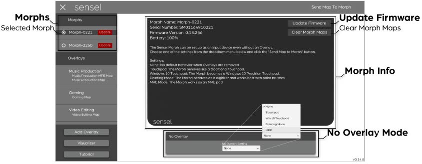
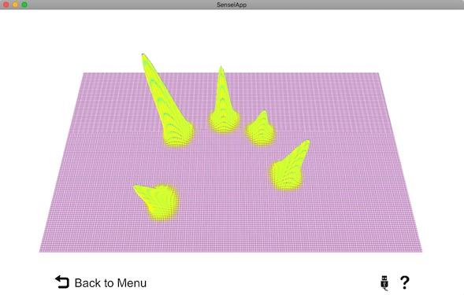
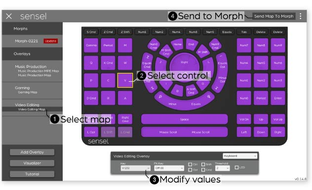
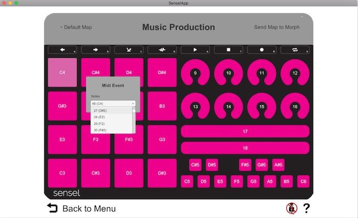
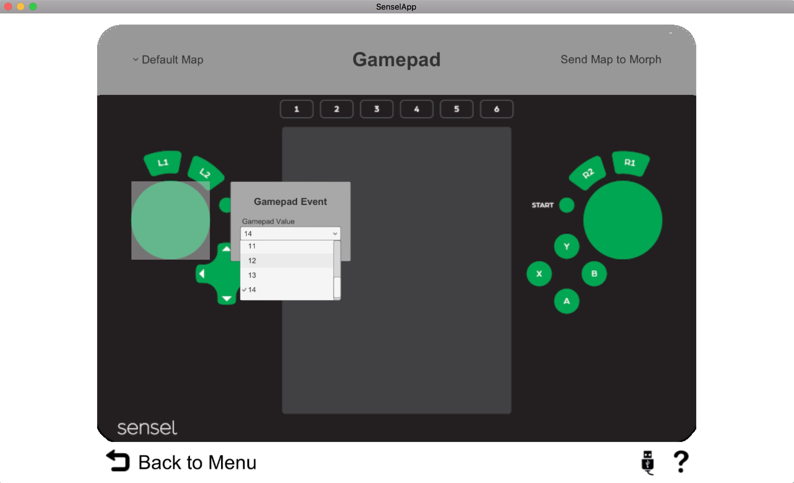

## SenselApp Software
The SenselApp is your entry point for maintaining and modifying your Sensel Morph. It can be used for simple tasks such as updating firmware or visualizing the contacts and pressure, modifying existing overlays to better match your workflow, or radically transforming your overlays from their intended purpose into completely custom controllers. In short, the SenselApp can be used to execute all the possibilities of the Morph.

### Download
You can download the SenselApp using these links:

* [Windows](http://senselapp.com/download/win.php)
* [Windows 32-bit](http://senselapp.com/download/win32.php)
* [MacOS](http://senselapp.com/download/mac.php)

### SenselApp Overview

When an overlay is selected in the SenselApp, your screen will appear as below. 

* Morphs - A list of all the Morphs attached via USB to your computer. Click on one in the list to get information about the Morph, such as serial number, firmware version, and battery level. You can also set the “No Overlay” Mode here.
* Update Firmware - A red “Update Firmware” indicates that Sensel has a new version of the firmware available for your morph. It is best to always update when possible. Click on the Morph's name in the Morphs panel to show the **Update Firmware** button.
* Overlays - This area shows all overlays and their associated maps that you have added to the Sensel App for the selected Morph.
    * Map Name - Click the Map Name to bring up the Overlay Mapper and edit its values. You must press **Send Map to Morph** to make these changes present on the Morph. 
* Functions:
    * Add Overlay - Click this button to add a new overlay and modify the controls for any given overlay. 
    * Visualizer -  Click to turn on the visualizer to view all contacts and their pressure levels.
    * Tutorial - Toggles hints for a quick reminder of what each section is for. 
* Overlay Mapper - Click on a Map Shows the selected overlay and its controls for editing and re-assigning. Click on any control to fill the Inspector with current values. 
* **Send Map** Button - Click to send to the Morph any changes made to the Map with the SenselApp. 
* Inspector - Used to edit the output and behavior of any control, such as changing its type, key value, or MIDI message output.
* Top Menu - Contains functions for copying, editing, and sharing map files for the different overlays.
* Hide Left Panel - Click the **X** in the top left to hide the left panel.
* Current SenselApp Version - shows the version number of the Sensel App.

When a Morph is selected in the SenselApp, your screen will look similar to below.

* Selected Morph - Select a Morph from the list of USB-connected Morphs to display the Morph Info screen. 
* Morph Info - Shows Morph name, serial number, firmware version, and battery level. Additional text describes possible behaviors for using the bare Morph.
* Update Firmware - click to download firmware files from Sensel servers and update the firmware on the device.
* Clear Morph Maps - Clear all Map files that have been uploaded to the Morph.
* **No Overlay Mode** Selector - Use this menu to select how the Morph behaves with no overlay. Descriptions are in the Morph Info screen.

To quit the app, you can use Alt+F4, Cmd+Q (Mac), Control+Q (Win), or click the close button on the title menu if it is available. 

### Visualizer

Before we get too busy, let's have a little bit of fun. Click on the **Visualizer** button and attach a Morph. Press on the sensor with your fingers, and see the corresponding pressure image on your computer screen.

Use the Visualizer to view the raw pressure information coming from the Morph's sensor. The visualizer is more than entertaining, it's a look behind the scenes of what happens when you are using the Morph. 

You can see the effects of using different materials between a stylus (or some other actuator, like a finger) and pressure surface. You can even see that very sharp styli won't generate much of a pressure reading, and benefit greatly from a material or overlay. 

The curious and creative user will find great satisfaction in the Visualizer!

### SenselApp: First Use

The first time you use the Sensel App, it will appear with the Help hints visible, which you can read over and turn off using the Tutorial button. You may need to update the firmware - just click on the Morph name and then click the **Update Firmware** button in the Morph Info window.

To get started editing controls on your overlays, click "Add Overlay" and select the type of overlay you want to add:

Notice there are multiples of some overlays. These are alternate mappings for MIDI Polyphonic Expression (MPE) that make it easy to set up an overlay as an MPE controller. If you select an MPE variant, you'll need to "Send Map to Morph" for those settings to work on your Morph.

If you place an overlay on the Morph before you open the App, the SenselApp will open in the Overlay Mapper view, showing the Overlay you placed on the Morph. 

The SenselApp has a built-in MIDI piano. If you have a Piano, Drum Pad, or Music Production Overlay selected, you can hear the notes that the controls output. This makes it easy to confirm that notes are assigned as you want them on the device. Use the top right menu to "Mute/Unmute" the piano if you wish to turn the sound on or off. 

### Editing an Overlay

Editing an Overlay's output and behavior is fairly straightforward, though the large array of options can make it seem complicated. Simply put, modifying a single control takes 4 steps.

1. Select an overlay
1. Click on a control
1. Change values in the inspector
1. Send Map to Morph

You can repeat steps 2 & 3 several times, making all your edits, then send the map to the Morph when you are ready to try your changes. 

An edit can be very simple. For example, on the video editing overlay, you may want to adjust the controls for Apple Final Cut Pro. The **Selection** button outputs the letter *v* for Adobe Premier, but Final Cut Pro X uses the letter *a* for the shortcut. Making this change is as simple as selecting **A (4)** from the **Key** menu:

You can, of course, make very different changes. You can add modifiers for other macro commands in a video editing software, or even go into left field and make it send a MIDI message to control music software.

All the different types of controls and the values you can change in the Inspectors are documented below.

### Top Menu

The top right menu has several functions for managing individual map files. 

* Rename Map - renames the currently selected map.
* Delete Map - deletes the currently selected map.
* Duplicate Map - creates a copy of the map currently selected in the left pane
* Import - opens a file selection dialog to select a map file to import into the App
* Export - save the currently selected map to a file you can share
* Revert to Original - reverts all settings to the Overlay's default map
* Mute/Unmute - turn off the built-in piano sounds

If you are curious where the preferences and map files are stored on your computer, they are at:
* Mac: `~/Library/Application Support/unity.Sensel.SenselApp/`
* Windows: `%appdata%/../LocalLow/Sensel/SenselApp/`

### Control Types
With the Morph, everything is anything. That is to say, any individual control can be assigned to behave like any control found on any overlay. Want 16 mice on your Music Production overlay? Want to turn your QWERTY keyboard into a MIDI controller? Want to turn the Video Editor into a DJ controller? All this is very very possible. Here's the rundown on all the possible types of controls you can create. 

#### Keyboard
When pressed, the control sends messages that you would find on a regular computer keyboard used for typing or data entry.

 * Key - Keyboard [scan code](http://www.usb.org/developers/hidpage/Hut1_12v2.pdf) (or letter) to output on press
 * Function Key - Keyboard scan code (or letter) to output on press when the *fn* key is held down. Of course, you'll need to assign a different control to act as the *fn* key, which is done by assigning a key with scan code **255 (FN)**.
 * Modifier - Ctl, Opt, Shift, CMD modifier to combine with a press on this control. Used for creating macros, such as *Ctl-S* to save a file in a Windows application.
 * Threshold - pressure threshold. Lower values make the control require less pressure to register a press.
 * LED - blink (checked) or don't blink (unchecked) the nearest LED on the LED strip when the control is pressed.

#### MIDI Note
When pressed, a combination of [MIDI](https://en.wikipedia.org/wiki/MIDI) messages are sent, with the first message sent being of the Note type, similar to a regular piano keyboard.

 * Channel - MIDI Channel the messages from this control are sent on.
 * Note - MIDI note to send on press. The note-on velocity corresponds to the initial pressure of the contact. Can be left off so the control only sends a message on pressure.
 * After-Pressure - MIDI Message to send to report pressure values while the control is held down. These can be MIDI Continuous Controller messages, Pitchbend, Polyphonic Aftertouch, or Channel Aftertouch type. 
 * Threshold - pressure threshold. Lower values make the control require less pressure to register a press.
 * LED - blink (checked) or don't blink (unchecked) the nearest LED on the LED strip when the control is pressed.

#### MIDI CC
When pressed, a combination of [MIDI](https://en.wikipedia.org/wiki/MIDI) messages are sent, with the first message sent being of the Continuous Controller type. When the control is pressed, a CC value of 127 is sent. When the control is released, a CC value of 0 is sent. This is useful for controlling buttons in different music softwares.

 * Channel - MIDI Channel the messages from this control are sent on.
 * CC - CC number to send values of 127 (down) and 0 (up). 
 * After-Pressure - MIDI Message to send to report pressure values while the control is held down. These can be MIDI Continuous Controller messages, Pitchbend, Polyphonic Aftertouch, or Channel Aftertouch type. 
 * Threshold - pressure threshold. Lower values make the control require less pressure to register a press.
 * LED - blink (checked) or don't blink (unchecked) the nearest LED on the LED strip when the control is pressed.

#### Media
*Media* refers to the control keys for displays and sound commonly found on computer keyboards. This allows any control to act as a system-level control for your computer's audio and video apps.

 * Media - type of control, such as Volume, Display Brightness, Next/Previous track, Play/Pause, Home, App Switch, or Search.
 * FN Key - a secondary key code value that will be sent when a *fn* key is held down.
 * Modifier - Ctl, Opt, Shift, CMD modifier to combine with a press on this control. Used for creating macros, such as *Ctl-S* to save a file in a Windows application.
 * Threshold - pressure threshold. Lower values make the control require less pressure to register a press.
 * LED - blink (checked) or don't blink (unchecked) the nearest LED on the LED strip when the control is pressed.

#### Gamepad
When pressed, a Gamepad control sends out a USB Gamepad control code. 

 * Type - determines how motions are interpreted. Square button, Circle button, and Joystick react differently to touch inputs, providing either button-like or continuous control.
 * Button - value sent on press. Joystick with button sends joystick commands an a button on press.
 * Threshold - pressure threshold. Lower values make the control require less pressure to register a press.
 * LED - blink (checked) or don't blink (unchecked) the nearest LED on the LED strip when the control is pressed.

#### MMC (MIDI Machine Control)
[MMC System Exclusive (sysex) messages](https://en.wikipedia.org/wiki/MIDI_Machine_Control) are used to control the transport of software and hardware recorders and sequencers. 

 * MMC Message - Message sent on press. 
 * After-Pressure - MIDI Message to send to report pressure values while the control is held down. These can be MIDI Continuous Controller messages, Pitchbend, Polyphonic Aftertouch, or Channel Aftertouch type. 
 * Threshold - pressure threshold. Lower values make the control require less pressure to register a press. 
 * LED - blink (checked) or don't blink (unchecked) the nearest LED on the LED strip when the control is pressed.

#### Morph MIDI Modifier
The MIDI Modifier type modifies the MIDI values sent out the Morph. For many of these, no messages are sent, rather, these simply modify the messages the Morph will send.

 * Custom MIDI - type of modifer, such as Octave Up/Dn (+/- 12 notes), Scene Up/Down (+/- 16 notes, for Ableton and Bitwig drum racks), MIDI Program change, and others.
 * After-Pressure - MIDI Message to send to report pressure values while the control is held down. These can be MIDI Continuous Controller messages, Pitchbend, Polyphonic Aftertouch, or Channel Aftertouch type. 
 * Threshold - pressure threshold. Lower values make the control require less pressure to register a press. 
 * LED - blink (checked) or don't blink (unchecked) the nearest LED on the LED strip when the control is pressed.

#### MPE
[MIDI Polyphonic Expression](https://www.midi.org/articles/midi-polyphonic-expression-mpe)(MPE) allows electronic instruments to be played with much more control and dimension than simply turning a note on or off. A single control can send the note, velocity, pitch bend on side-to-side motions, expression on vertical slides on the control, and afterpressure. MPE-compliant synths can react to all of this played data for exceptional expression. The Morph takes it a step further and allows you to use all the data in different ways.

 * Note - Note value to send on press.
 * Press - Message type to send on Pressure. *MPE standard is to send Channel Aftertouch for pressure.*
 * X - Message type to send on X, or side-to-side, motions on the control. *MPE standard is to send Pitch Bend messages for X.*
 * Y - Message type ot send on Y, or up-down motions on the control. *MPE standard is to send CC 74 messages for Y.*
 * Pitch Range - Pitch bend range to send on X.
 * Threshold - pressure threshold. Lower values make the control require less pressure to register a press.
 * 14-bit - Check on to send 14-bit resolution messages for Pressure and Y dimensions. This adds an additional Continuous Controller to the data output to create two 7-bit messages.
 * Absolute Position - If on, then the physical center of the control is the center point for X and Y values. If off, then the point of initial contact is the center point for X and Y values.
 * * LED - blink (checked) or don't blink (unchecked) the nearest LED on the LED strip when the control is pressed.

#### Touchpad
The Touchpad control type creates a mouse pointer such as you would find on a laptop.

 * Touchpad Type - Several types of pointers. 
 
    * Switch to Stylus
    * Switch to Paintbrush
    * Switch to Trackpad
    * Stylus Area
    * Paintbrush Area
    * Trackpad Area

 * Click Activation - A threshold that will determine if you are clicking on the trackpad.
 * Threshold - pressure threshold. Lower values make the control require less pressure to register a cursor movement. 
 * LED - blink (checked) or don't blink (unchecked) the nearest LED on the LED strip when the control is pressed.
 
#### Setting

 * Setting
 * Value
 * Threshold
 * LED

#### Keyboard Slider
A keyboard slider type sends repeated keystrokes depending on the direction you are stroking the slider. You can find these types of controls on the Video Editing Overlay's defaults for Zoom, Audio, and Video sliders. 

 * Right/Up - depending on the orientation of the control, you'll see *Right* or *Up*. Assign a key value to send repeatedly.
 * Left/Down - depending on the orientation of the control, you'll see *Left* or *Down*. Assign a key value to send repeatedly.
 * Modifier - Ctl, Opt, Shift, CMD modifier to combine with a press on this control. Used for creating macros, such as *Ctl-S* to save a file in a Windows application.
 * Threshold - pressure threshold. Lower values make the control require less pressure to register a press.
 * LED - blink (checked) or don't blink (unchecked) the nearest LED on the LED strip when the control is pressed.

#### MIDI CC Slider
A MIDI CC Slider is used to send continuous values, depending on the position of the touch. Useful for filter sweeps, volume envelopes, and other effects.

 * Channel - MIDI Channel the messages from this control are sent on.
 * CC - CC message to send with continuous value.
 * After-Pressure - MIDI Message to send to report pressure values while the control is held down. These can be MIDI Continuous Controller messages, Pitchbend, Polyphonic Aftertouch, or Channel Aftertouch type. 
 * Threshold - pressure threshold. Lower values make the control require less pressure to register a press. 
 * LED - blink (checked) or don't blink (unchecked) the nearest LED on the LED strip when the control is pressed.

#### Knob Modifier

 * CW
 * CCW
 * Modifier - Ctl, Opt, Shift, CMD
 * Threshold
 * LED

#### Pressure Button
Unique to the Morph, the Pressure button control sends repeated keystrokes with the repetition speed varying by pressure. 

 * Down - assign a key code to send repeatedly when pressing down on the button.
 * Up - assign a key code to send once when the button is released.
 * Modifier - Ctl, Opt, Shift, CMD modifier to combine with a press on this control. Used for creating macros, such as *Ctl-S* to save a file in a Windows application.
 * Threshold - pressure threshold. Lower values make the control require less pressure to register a press.
 * LED - blink (checked) or don't blink (unchecked) the nearest LED on the LED strip when the control is pressed.

### Overlay Mapper

#### Music Overlays

The Music Production, Drum, and Piano Overlays can be completely modified from their default settings to work however you’d like them to.

When you select a music Overlay from the Sensel App, you'll open a screen where you can click on the different buttons or regions to modify the MIDI notes sent from the pads. 

Use the inspector's menu to select a different note value for each pad you want to change. You can save the settings to a map preset. 

When finished editing, be sure to click "Send Map to Morph" to modify the settings.

#### QWERTY (+ AZERTY and DVORAK) Overlay

In a way, the mapper for the QWERTY Overlay is very similar to the music editors. However, instead of modifying MIDI notes, you are modifying the key event codes from each stroke. A list of keyboard codes can be found at [this link.](https://en.wikipedia.org/wiki/ASCII#Code_chart)

##### Set Keyboard Layout
The Morph will detect the Overlay attached to the device, but you will need to change the desired layout for each computer or smartphone. Following are some external links to guides (and opinions) on changing your keyboard layout for different operating systems:

* [Windows 10](http://www.windowscentral.com/how-change-your-keyboard-layout-windows-10)
* [macOS](http://atmac.org/dvorak-keyboard-layouts-easier-on-the-fingers)
* [Ubuntu](http://www.wikihow.com/Change-Keyboard-Layout-in-Ubuntu)
* [Android](https://rietta.com/blog/2013/09/20/is-the-colemak-or-dvorak-keyboard-layout-best-for-you/)
* [iOS](https://www.igeeksblog.com/how-to-change-keyboard-layout-on-iphone-and-ipad/)

#### Gamepad Overlay

Some games support HID gamepad events without any emulation, but do not let you customize the button values in the game. As a result, the controller might work, but the buttons all do the wrong thing! The Sensel App lets you change the HID gamepad value for each button of the Gamepad Overlay so the controls can match the gameplay.
