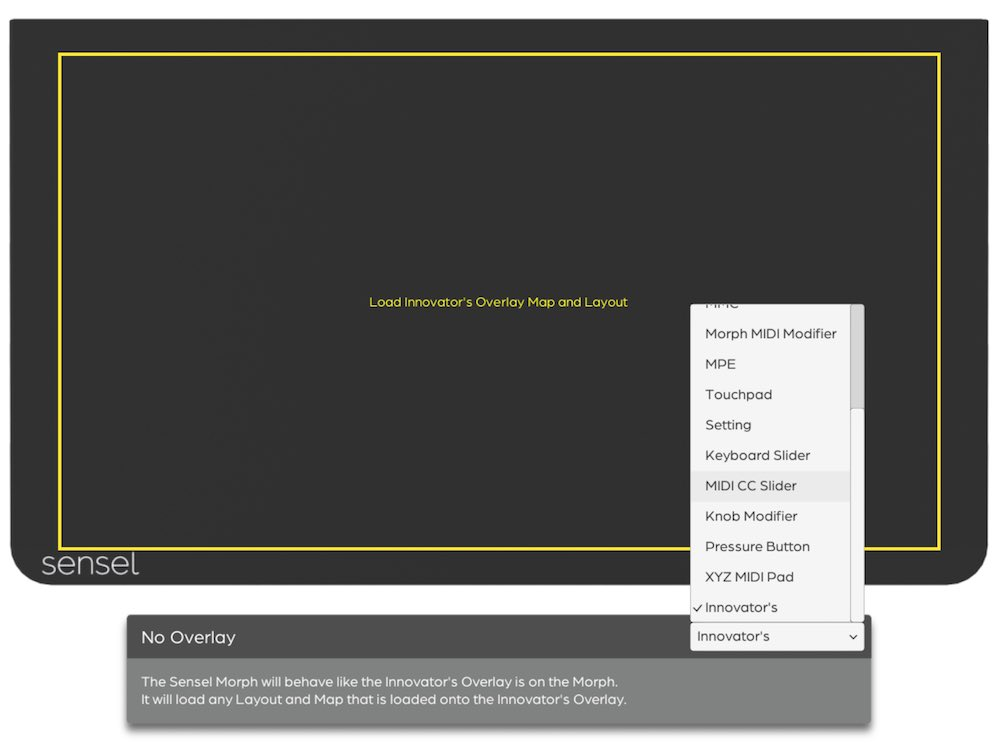
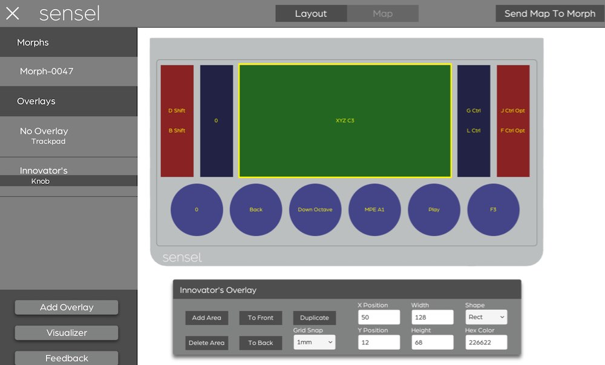

# Overlay Designer
The SenselApp Overlay Designer lets you design custom Overlays. You can combine different control shapes and command outputs - keyboard macros, MIDI commands, mouse pads, and more - to make up your own Overlay. 

Each design has a control area **layout** and a control area **mapping**. The layout can be printed to paper to mark your controller. The mapping is sent to the Morph so it can interpret your touches and send out the right commands. The mapping is loaded with the Innovator’s Overlay on the Morph. It is also possible to build or 3D print your own Overlay that uses the Innovator’s Overlay magnetic layout which will signal the Morph to load your custom mapping. 

The following sections document how to design an Overlay in the SenselApp and some guidance for creating your custom Overlay.

## Designing an Overlay
The first step is to decide what problem you want to solve and what controls you need to touch. This is done in the SenselApp using the Innovator's Overlay.

### Innovator's Overlay

The Innovator’s Overlay is a transparent Overlay with an indented "tray" that can contain your custom design. The Innovator’s Overlay allows for 2D printed layouts to be put under the Overlay and 3D Overlays to be placed in the middle region. We detail how to print 2D and 3D print Overlays in the [Creating an Overlay](#creating-an-overlay) section.

#### No Overlay
If you do not own an Innovator’s Overlay, you can use the bare sensor to act as the Innovator’s Overlay by creating a No Overlay map. Here's how:
 
* go to **Add Overlay**
* choose **No Overlay**
* change the control area type to Innovator’s
* click **Send Map to Morph**. 

Now your Morph will behave as if an Innovator’s Overlay is on the device when no overlay is placed on the Morph. You can also purchase the Innovator’s Overlay from [our store](https://sensel.com/collections/overlays/products/innovators-overlay).

### Create a Design

To start creating a design, click **Add Overlay** in the Sensel App. This will bring up a list of all existing Overlay choices. Click the **Innovator’s Overlay** icon to begin. 

The Overlay Designer will look very similar to a standard SenselApp map, but will include a toggle at the top of the SenselApp that allows you to switch between Layout and Map. The custom design will start in Layout.

### Layout

Layout allows you to add, remove, reposition and customize control areas. Layout can only be found in the Innovator’s Overlay for the Overlay Designer.

* **Add Area** Adds a new control area to the design.
* **Remove Area** Removes a control area from the design.
* **To Front** Brings the control area to the front of the design.
* **To Back** Sends the control area to the back of the design.
* **Duplicate** Duplicates the dimensions and map of the control area.
* **Grid** Snaps control areas to specific grid spacing in mm
* **X Position** Horizontal position of the control area in mm.
* **Y Position** Vertical position of the control area in mm.
* **Width** Width of the control area in mm.
* **Height** Height of the control area in mm.
* **Shape** The visual shape of the control area. Currently, all widgets respond as a rectangle but this will be resolved in a future firmware update.
* **Hex Color** The color of the control area. You can search for a color at color-hex.com or type in a common name for a color into the text box (i.e. blue, green, black).
* **Import Background** Under the overflow menu at the top right, you can find the Import Background option, which allows you to open a .jpg or .png image and show a semi-transparent version of the image over the Overlay to use as a template. The image should be the full size of the Innovator’s Overlay (240mm by 140mm) as the image will be scaled to fit that size.

### I'm Not Used To Millimeters
For those not accustomed to millimeters, here's a couple handy approximations: 

* 10 mm is 0.4 inches
* 1 inch is 25 mm

The Morph's sensor area is 240 mm x 138.5 mm. If you wanted to make an 8x4 grid of squares evenly distributed over the Morph, here's the dimensions you would use:

### Map

Map Mode offers the same behavior as a standard SenselApp overlay map. To assign controls to an area, click on an area to populate the inspector. You can now assign types and parameters to program the control. Learn more about the [control types here](http://guide.sensel.com/app/#control-types).

As always, the map must be sent to the Morph using the "Send To Morph" button. Once that is done, the Morph will use your custom controls anytime you place the Innovator's Overlay on it.

## Creating an Overlay

Once you have designed an overlay, there are several methods to test and make your own custom Overlay.

### Export for Printing

To export a Layout, go to the design you want to export, click the overflow menu at the top right, and click “Export 2D/3D File”. 

This opens a file browser window titled “Export a Sensel Layout”. First, navigate to the directory you want to export the design to. Then, select the file format you wish to create and add a name:

* **SVG** A vector image that works best for printing or as a stencil. The outline of the overlay is 240mm by 140mm.
* **PNG** An image file that works best for printing. The image is sized to fit under the Innovator’s Overlay (240mm by 140mm).
* **STL** A 3D model of the Overlay Design. This is designed to sit inside of the Innovator’s Overlay and can be a starting place for creating your own Innovator’s Overlay. (231.6mm by 113.8mm)

### 2D Print

To print an Overlay Design, export the Layout as either a SVG or PNG. Each image is sized to fit under the Innovator’s Overlay.

Before printing, if you want to add any text or additional details to the design, you can bring the image into your favorite art program to make the changes. Make sure not to modify the size or resolution in order to maintain the proper size under the Innovator’s Overlay (240mm by 140mm).

When ready, print out the image onto paper or other very thin material. Then, follow the instructions on the image in order to cut it out. Finally place, the image under the Innovator’s Overlay. This should provide a visual guide for your custom design.

### 3D Print

An Overlay design can either be 3D printed as an insert or a full Innovator’s Overlay.

#### Insert

With an insert, the design sits inside of the Innovator’s Overlay. This allows for rapid prototyping and does not require you to create a full Innovator’s Overlay. The Sensel App will export an STL file that can be 3D printed and fit inside the Innovator’s Overlay. 

We generally recommend printing inserts and not printing the entire Innovator’s Overlay, since this can significantly lower the cost of the 3D print.

#### Full Innovator's Overlay

To create a Innovator’s Overlay with your own custom design, you should start with this Innovator’s Overlay design [model](https://drive.google.com/file/d/1tyvCzdeXae0IyEFUMgDJIL8ylRp8XKrd/view?usp=sharing) and [document](https://drive.google.com/file/d/1kN70wA4Vi7Ol88b5CRPtEdXD8ndPgy0d/view?usp=sharing). Then, you will need to merge the design created by the Overlay Designer with the Innovator’s Overlay model to create your own custom Innovator’s Overlay. At this moment, we do not export a combined insert and Innovator’s Overlay from the Sensel App.

In addition to your Custom Innovator’s Overlay, you will need magnets and two strips to hold the magnet in place. We will be providing more information about magnets in the near future.

#### Materials

We are currently evaluating available 3D printed materials in order to determine which materials offer an the optimal experience at a reasonable cost. If constructed of a base and buttons, like the STL created in the SenselApp, then the material needs to be thin and flexible to transmit the force to the Morph. Here are a few materials we are currently evaluating:

* **Rubber-like Polyjet**: This material with a low Shore Hardness, like 27A TangoBlack Plus, offers high flexibility and high resolution force transmission. The material may come out somewhat sticky, but fits nicely into the Innovator's Overlay.
* **Shapeways Elasto Plastic**: A flexible 3D printed material but may have some bends in the material so it will not sit flat against the Morph. Not optimal for high resolution force transmission.
* **Ninjaflex**: A flexible 3D printed material that comes in a wide array of colors. Ninjaflex is not as flexible as polyjet, so it does not transmit the force as well. As a result, we do not recommend Ninjaflex for custom overlays that require high positional accuracy.

We will be adding more recommendations as we test available materials.

### Other Materials and Handmade Overlays

In addition to 2D and 3D printing, there are many other ways to create a visual representation of a custom Overlay. You could cut shapes out of silicon/felt/construction paper, paint/draw on the shapes onto a flexible sheet, create a latex mold, etc. With all of these options, we recommend using flexible materials so that force can be transmitted accurately. 

**NOTE:** We do not recommend using adhesives, paints, markers, or any other unverified material on the Sensel Morph or Innovator’s Overlay. We will not replace a product if either is visually or physically damaged from creating or using a custom Overlay.
