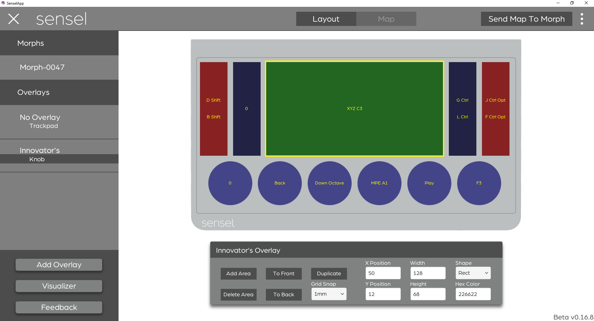
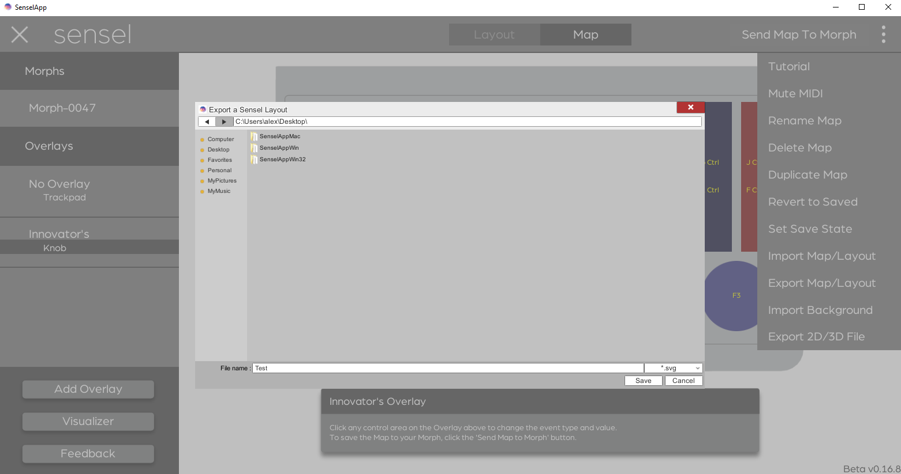

# Overlay Designer
The SenselApp Overlay Designer allows you design custom Overlays. Each design has a control area layout and a control area mapping that can be sent to the Morph to work with the Innovator’s Overlay or a custom built Overlay that uses the Innovator’s Overlay magnetic layout. The following sections document how to design an Overlay in the SenselApp and some guidance for creating your custom Overlay.

## Designing an Overlay

### Innovator's Overlay

The Innovator’s Overlay is a transparent Overlay with a lower middle region surrounded by a frame. The Innovator’s Overlay allows for 2D printed layouts to be put under the Overlay and 3D Overlays to be placed in the middle region. We detail how to print 2D and 3D print Overlays in the Creating an Overlay section.

If you do not own an Innovator’s Overlay, you can set the bare sensor to be the Innovator’s Overlay by creating a No Overlay map. To do so, go to Add Overlay, add a No Overlay, change the control area type to Innovator’s (in dropdown menu on top right of inspector) and then Click Send Map to Morph. Now your Morph will believe the Innovator’s Overlay is on the device when No Overlay is on the Morph. You can also [purchase the Innovator’s Overlay at our store](https://sensel.com/collections/overlays/products/innovators-overlay).

### Create a Design

To start creating a design, click Add Overlay in the Sensel App. This will bring up a list of all existing Overlay choices. Click Innovator’s from the list of Overlays to begin your design. 

The Overlay Designer will look very similar to a standard SenselApp map, but will include a toggle at the top of the SenselApp that allows you to switch between Layout and Map. The custom design will start in Layout.

### Layout

Layout allows you to add, remove, reposition and customize control areas. Layout can only be found in the Innovator’s Overlay for the Overlay Designer.

* Add Area: Adds a new control area to the design.
* Remove Area: Removes a control area from the design.
* To Front: Brings the control area to the front of the design.
* To Back: Sends the control area to the back of the design.
* Duplicate: Duplicates the dimensions and map of the control area.
* Grid: Snaps control areas to specific grid spacing in mm
* X Position: Horizontal position of the control area in mm.
* Y Position: Vertical position of the control area in mm.
* Width: Width of the control area in mm.
* Height: Height of the control area in mm.
* Shape: The visual shape of the control area. Currently, all widgets respond as a rectangle but this will be resolved in a future firmware update.
* Hex Color: The color of the control area. You can search for a color at color-hex.com or type in a common name for a color into the text box (i.e. blue, green, black).
* Import Background: Under the overflow menu at the top right, you can find the Import Background option, which allows you to open a .jpg or .png image and show a semi-transparent version of the image over the Overlay to use as a template. The image should be the full size of the Innovator’s Overlay (240mm by 140mm) as the image will be scaled to fit that size.

### Map

Map Mode offers the same behavior as a standard SenselApp map. Simply, click on one of the control areas and you get access to the same controls on every other map. You can learn more about the [control types here](http://guide.sensel.com/app/#control-types).

## Creating an Overlay

Once you have designed an overlay, there are several methods to test and make your own custom Overlay.

### Export

To export a Layout, go to the design you want to export, click the overflow menu at the top right, and click “Export 2D/3D File”. 

A  file browser window should appear with “Export a Sensel Layout” on the top. First, navigate to the directory you want to export the design to. Then, select the file format you wish to create and add a name:

* SVG: A vector image that works best for printing or as a stencil. The outline of the overlay is 240mm by 140mm.
* PNG: An image file that works best for printing. The image is sized to fit under the Innovator’s Overlay (240mm by 140mm).
* STL: A 3D model of the Overlay Design. This is designed to sit inside of the Innovator’s Overlay and can be a starting place for creating your own Innovator’s Overlay. (231.6mm by 113.8mm)

### 2D Print

To print an Overlay Design, export the Layout as either a SVG or PNG. Each image is sized to fit under the Innovator’s Overlay.

Before printing, if you want to add any text or additional details to the design, you can bring the image into your favorite art program to make the changes. Make sure not to modify the size or resolution in order to maintain the proper size under the Innovator’s Overlay (240mm by 140mm).

When ready, print out the image onto paper or other very thin material. Then, follow the instructions on the image in order to cut it out. Finally place, the image under the Innovator’s Overlay. This should provide a visual guide for your custom design.

### 3D Print

An Overlay design can either be 3D printed as an insert or a full Innovator’s Overlay.

#### Insert

With an insert, the design sits inside of the Innovator’s Overlay. This allows for rapid prototyping and does not require you to create a full Innovator’s Overlay. The Sensel App will export a STL file that can be 3D printed and fit inside the Innovator’s Overlay. 

We recommend printing inserts and not printing the entire Innovator’s Overlay in order to save you time and money.

#### Full Innovator's Overlay

To create a Innovator’s Overlay with your own custom design, you should start with this Innovator’s Overlay design [model](https://drive.google.com/file/d/1tyvCzdeXae0IyEFUMgDJIL8ylRp8XKrd/view?usp=sharing) and [document](https://drive.google.com/file/d/1kN70wA4Vi7Ol88b5CRPtEdXD8ndPgy0d/view?usp=sharing). Then, you will need to merge the design created by the Overlay Designer with the Innovator’s Overlay model to create your own custom Innovator’s Overlay. At this moment, we do not export a combined insert and Innovator’s Overlay from the Sensel App.

In addition to your Custom Innovator’s Overlay, you will need magnets and two strips to hold the magnet in place. We will be providing more information about magnets in the near future.

#### Material Recommendations

Any 3D printed insert or Innovator’s Overlay needs to be made of thin, flexible materials that transmit the force through the material. We recommend the following materials:

* Polyjet with a low Shore Hardness: For instance, 27A TangoBlack Plus. This material offers high flexibility and high resolution force transmission. We do not recommend using polyjet with color as it often gets rigid and brittle. 
* Shapeways Elasto Plastic: A flexible 3D printed material.
* Ninjaflex: A flexible 3D printed material that comes in a wide array of colors. Ninjaflex is not as flexible as polyjet, so it does not transmit the force as well. As a result, we do not recommend Ninjaflex for custom overlays that require high positional accuracy.

We will be adding more recommendations as we test available materials.

### Other

In addition to 2D and 3D printing, there are many other ways to create a visual representation of a custom Overlay. You could cut shapes out of silicon/felt/construction paper, paint/draw on the shapes onto a flexible sheet, create a latex mold, etc. With all of these options, we recommend using flexible materials so that force can be transmitted accurately. 

NOTE: We do not recommend using adhesives, paints, markers, or any other unverified material on the Sensel Morph or Innovator’s Overlay. We will not replace a product if either is visually or physically damaged from creating or using a custom Overlay.
