#Morph Disassembly and Reassembly Guide

This guide explains how the Morph is put together.
You may want to access the internals of the Morph if you need to remove the battery.
The battery is rated at 3.7V, 420mAh.
If you do disassemble the Morph, this will void your warranty.
The Morph will function normally without a battery if connected to a USB host.

Removing the top panel is fairly simple, but you will need a Torx T6, or "star", driver to remove the screws. Torx T6 are pretty common in computers, and can be found at most online shops that have tools.

Tools needed:
* Torx T6 driver
* Xacto or other sharp blade
* Plastic scraper or old credit card
* Tweezers
* Gloves to keep adhesive off your fingers
* Small container for screws

Flip the Morph onto its back. You'll need to remove the top rubber feet and the serial number/compliance sticker which hide the three screws.

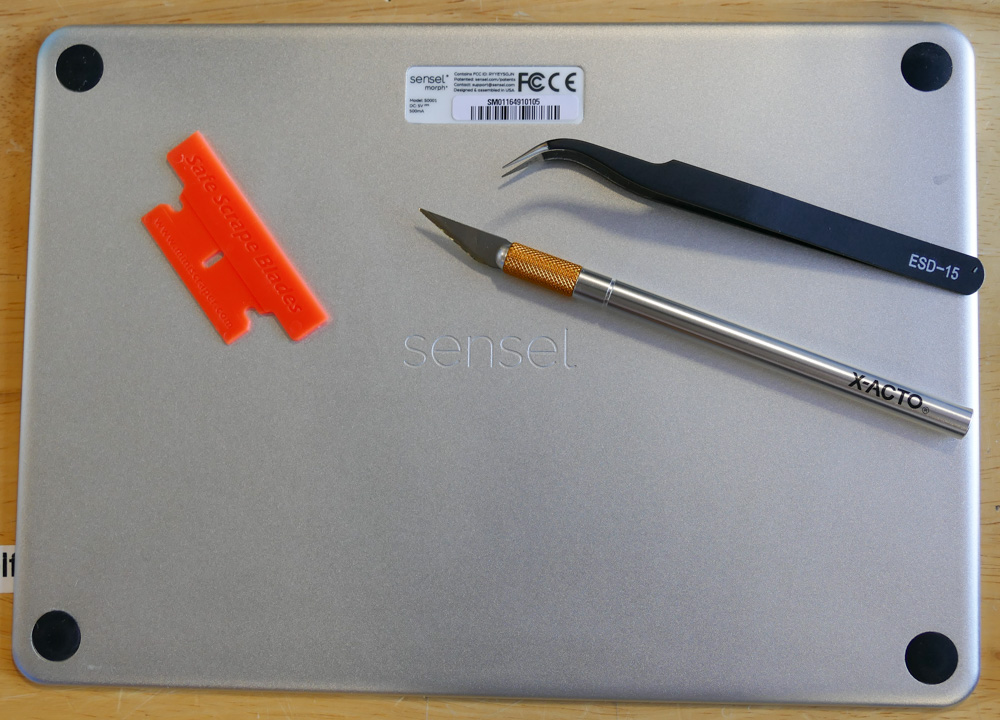

To remove the label, get under a corner with the sharp blade and gently pry it away from the metal. It is a strong adhesive, but will eventually come away pretty cleanly. Once you have a corner up, you can use your fingers, or switch to a plastic scraper to get the label fully off.

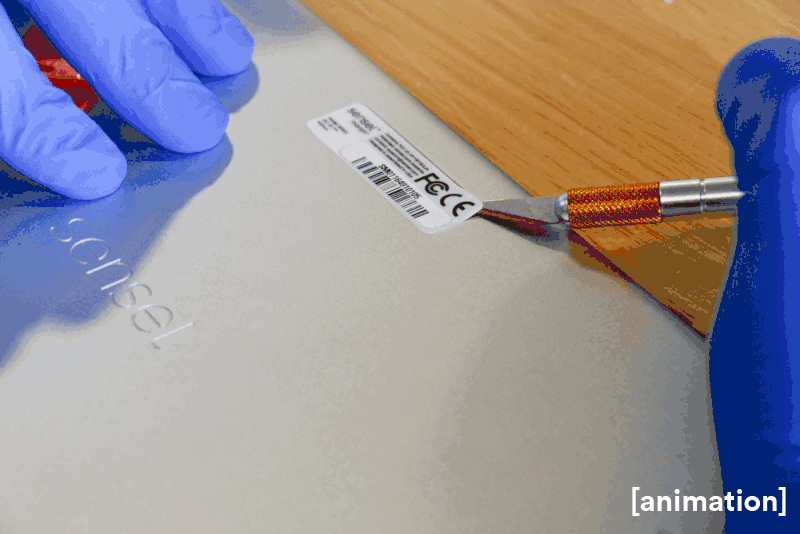

Now that you have the first screw revealed, you can use your Torx T6 driver to remove it. The tweezers can come in handy for the final removal. Place the screw in a container or on some tape. If you drop this screw, you will spend a very frustrating amount of time trying to find it, especially if you have shag carpet.

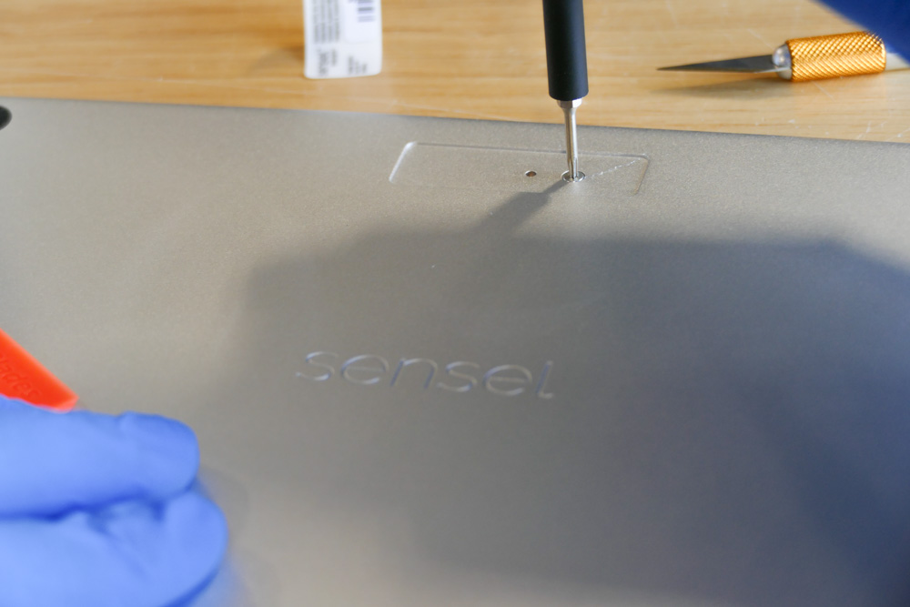
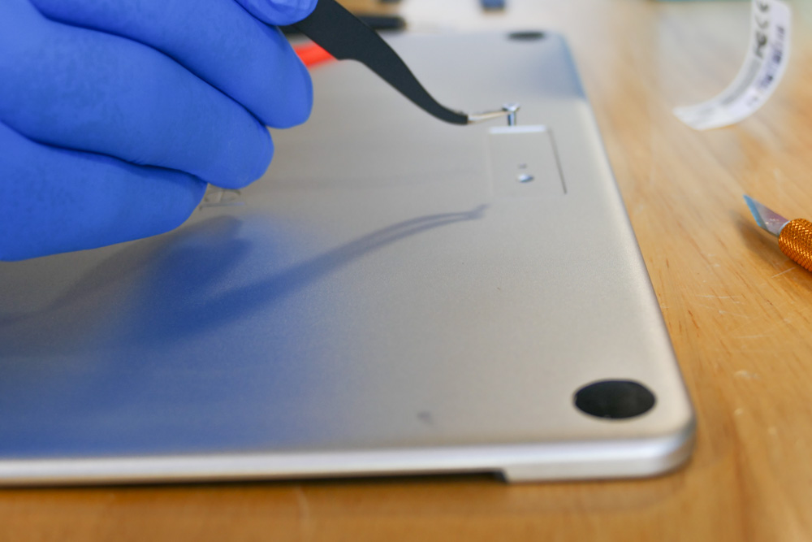

Reveal the final two screws by removing the top two rubber feet. Use your blade to get under and pry away the foot. Put aside adhesive side up - the adhesive is still sticky and you can use it to replace the foot when reassembling.

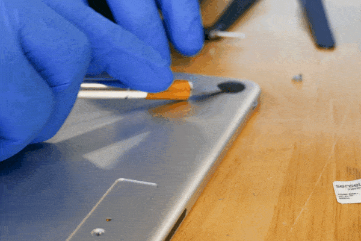

Use your Torx driver to unscrew these last two screws that secure the top panel to the rest of the Morph.

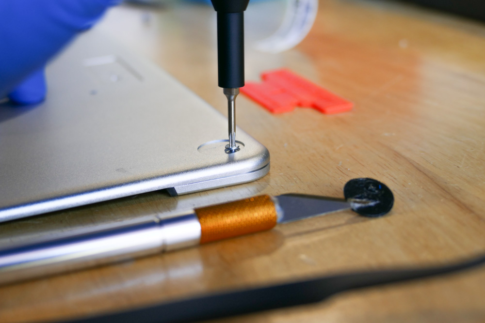

Now that all screws are out, pinch the top and bottom together and flip the Morph over. The top panel comes off easily. You will want to be careful when removing it, as the power button and the bluetooth lens are held in place only by the frame, and can easily fall out or be lost.

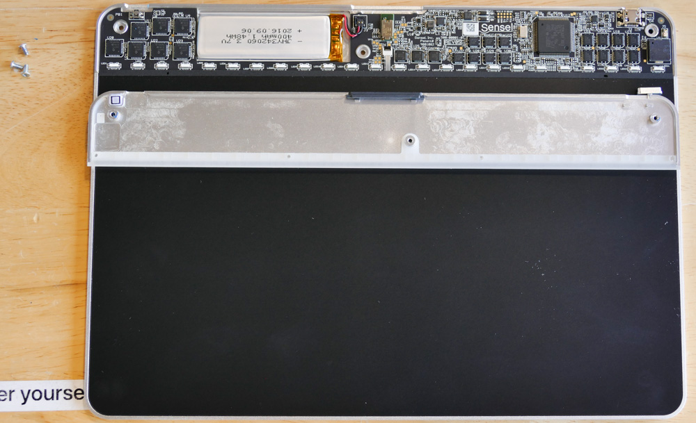

Here are detail views that show what might happen to the power button and the Bluetooth lens. We were lucky and caught the button off-camera before it fell into the shag carpeting.

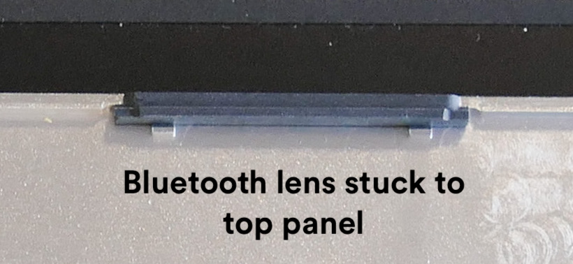
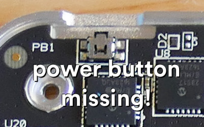

Here's how you remove the battery. It's connected to the circuit board with a small plastic connector that merely snaps into place, and held fast to the chassis by a small amount of adhesive. If your battery is swollen, it's a good idea to have safety goggles and gloves before attempting removal. It is easy to simply lift the plastic connector out with your fingers or use a plastic spudger tool, old credit card, or even a wooden toothpick. Don't use metal, as you may short the connections!

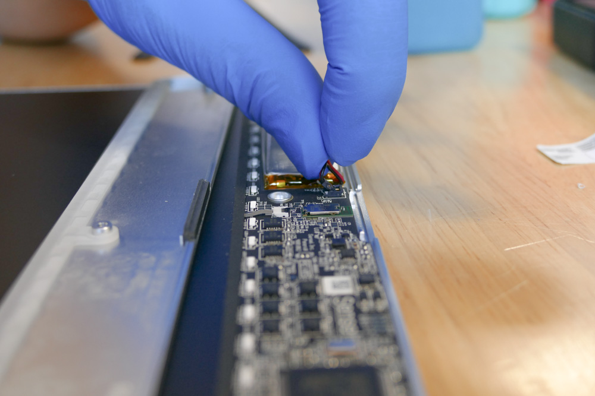

This is what the connector looks like when free from the board.

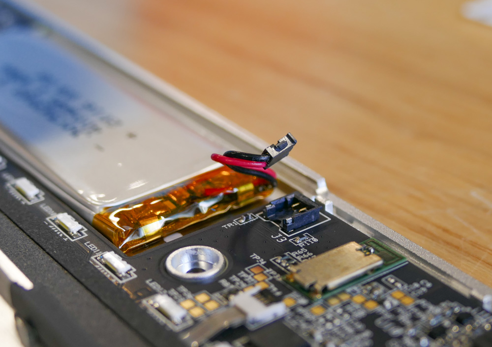

Now you can gently lift the battery away from the chassis. The adhesive is only a small dot in the center, so the batter is easily removed.

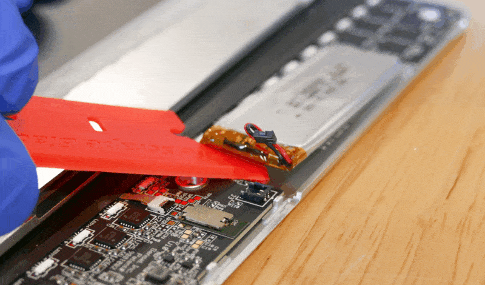

Reassembly is merely the reverse. The battery connector snaps into its place on the circuit board easily. You should feel a secure "snap" when you make the connection. If not, keep trying. The connector will be evenly flush when in place.

Make sure you get the power button in correctly:
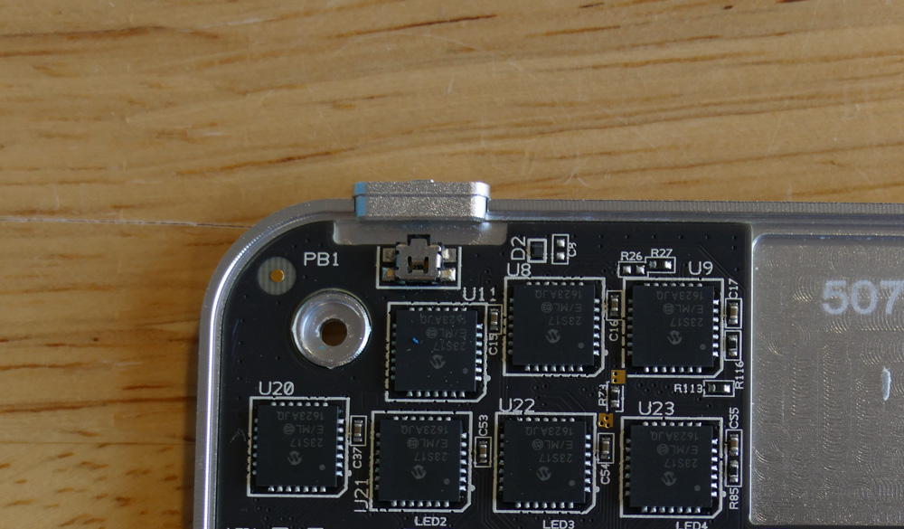

The Bluetooth lens is a bit fussier, as it has a specific orientation, with the narrower edge aligning to the side with the circuit board. You'll want to make sure the outside is flush with the outside of the metal enclosure:

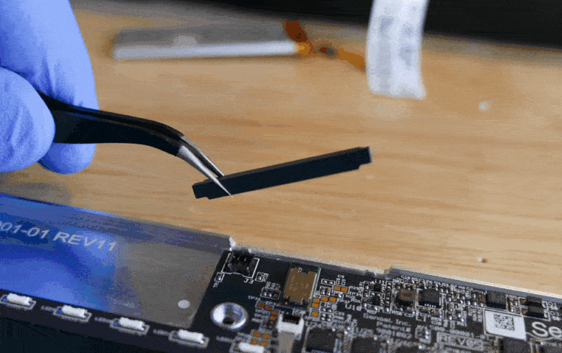

Pinch the top panel to the main Morph chassis and carefully turn the Morph over so you can replace the screws and feet.

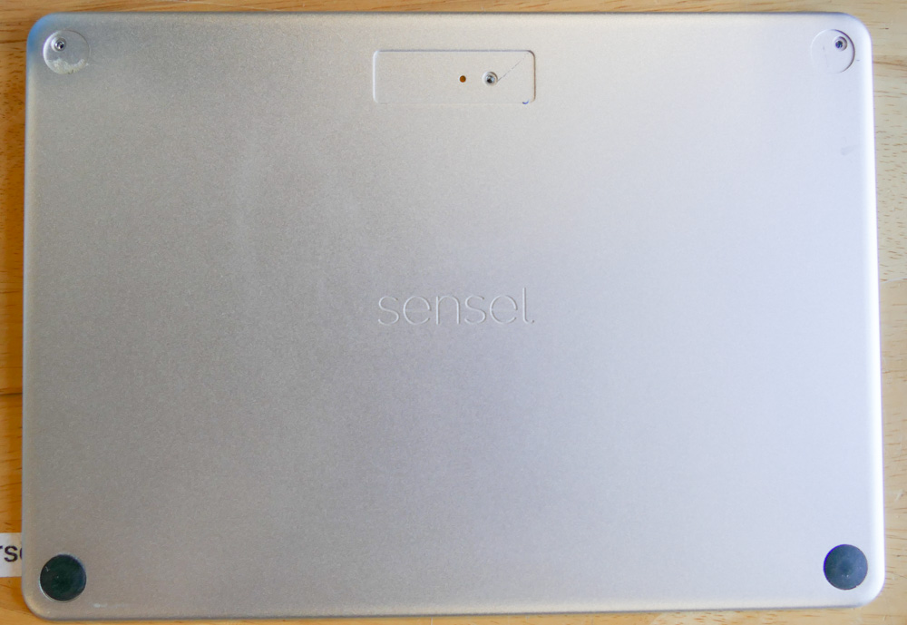

Use the Torx driver to replace the screws and put the feet back on. It's up to you if you want to try to put the compliance label back on or not - it may be too warped to use the existing adhesive, so you would probably need to use additional glue to get it secure.

All done!
