# Welcome
This User Guide explains the Sensel Morph hardware, features, software and, most importantly, how to use it. This User Guide is maintained in its own [github repository](https://github.com/sensel/morph-docs). If you have suggestions, corrections, or improvements, you can [log an issue](https://github.com/sensel/morph-docs/issues) or even fix it yourself and [make a pull request](https://github.com/sensel/morph-docs/pulls).

## Overview - What is Morph?
The Sensel Morph is a multi-touch, pressure sensitive, and reconfigurable control surface for artists, musicians, coders, and other creative people. 

There are several different Overlays for the Morph - each provides a different interactive interface for different creative softwares. Simply remove the current overlay and put down a new one - the Morph reconfigures and adapts to the new task at hand - playing music, editing video, drawing, playing games, or programming your own interface with the [Sensel API](api.md).

The Morph can be connected with USB or wirelessly via Bluetooth 4.0LE.

### Features
**Highly Sensitive**:

* Approx. 20,000 pressure sensors 5g - 5kg sensing range per touch (32,000 levels)

**Extremely Fast**:

* Full Resolution Mode: 125 Hz (8 ms latency)
* High Speed Mode: 500 Hz (2 ms latency)

**Precise Tracking**:

* 6502 dpi

**Versatile Connectivity**

* Bluetooth LE, USB, Serial (enabled with Innovator's Kit)

**On-the-Go Power**

* USB, Rechargeable Lithium Ion Polymer Battery

<a name="spec-fn1">1</a> - Overlays received in your box depend on Overlays ordered.

## Supported Operating systems

| Operating system | USB MIDI | Bluetooth LE MIDI | SenselApp |
| -----------------|----------------|----------|-----------|
| Mac OS X/macOS 10.10 + |  Yes | Yes | Yes |
| Windows 7 and 8 | Yes | No | Yes |
| Windows 10 Anniversary Edition | Yes | Yes | Yes |
| Ubuntu/Debian-based Linux<sup>[1](#os-fn1)</sup> | Yes | [Soon](https://blog.felipetonello.com/2017/01/13/midi-over-bluetooth-low-energy-on-linux-finally-accepted/) | No |
| Android | Yes | Yes<sup>[2](#os-fn2)</sup> | No |
| iOS | Yes | Yes | No |

<a name="os-fn1">1</a> - Many linux distributions will support USB MIDI. Only distributions that use the [bluez](http://www.bluez.org/) stack will support BLE MIDI.

<a name="os-fn2">2</a> - Supported in Android Marshmallow and up

## Quick Start
This guide will help you get your Morph out of the box and working with your computer or mobile device.

### 1 Download Software
Download the SenselApp mapping and configuration application from [the Sensel website.](http://sensel.com/start) This is a great tool for getting the most out of your Morph, and essential for updating its firmware.

### 2 USB connection
1. Remove the Morph and the supplied USB Micro cable from the box.
1. Connect the Morph to your Windows or MacOS computer with the USB cable.
1. The Morph will power up and automatically connect to your operating system.

### 3 Update Firmware
Make sure you have a reliable internet connection and launch the Sensel App on your computer with the Morph connected. The application will query our servers and find out if there is a firmware update available. If there is an update available, update your firmware and continue.

### 4 Launch the Visualizer
The Visualizer is the easiest way to see activity on your Morph and confirm that the hardware is communicating with your computer.


### Turning On, Turning Off

* Turn the Morph off by holding the button down for a few seconds. When the red LED light goes off, release the button. If you release the button before the light goes off, the Morph will still be drawing power.
* The Morph will automatically turn on when connected to a USB host.
* If off, hold the button down for a second or so to turn on. Release when the LED light turns white (USB) or turns blue (wireless).
* If the Morph is plugged into USB, disconnecting from USB will turn power off.

## Hardware
At first glance, the Sensel Morph appears a fairly simple piece of hardware. It consists of a flat rectangular area of force-sensing circuitry, a slightly raised area that contains additional processing circuitry, LEDs, a button, and micro USB connector. This sleek hardware is actually quite powerful, as you’ll find out. 

### Features

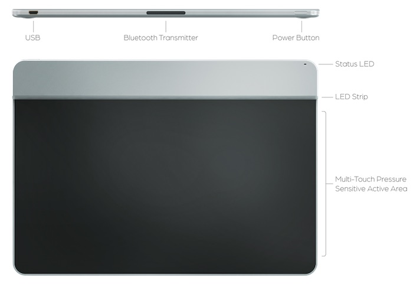

### LEDS
There are two locations for LEDs on the Morph. The single LED on the top right corner of the device can show a variety of colors, and the LED strip which will always be white. 

#### Status RGB
This LED changes colors to indicate different statuses. The different color and blink patterns are as follows:

* _White_: Communication is happening to the device over USB
* _Blue stable_: The device is in bluetooth mode
* _Blue pulsing_: The device is in bluetooth pairing mode
* _Yellow_: The device is in update mode (this means you should open the Sensel App and update the firmware on your device)
* _Purple_: The device is communicating through the Developer's Cable (you won't see this unless you're using the Developer's Cable from the Innovator’s Kit)
* _Red_: Indicates a low battery or powering off device. To turn off the Morph, press and hold the power button for 5 seconds. After 2 seconds the red LED will turn on. Wait until the LED turns off before releasing the power button.

#### Strip
There is a strip of 24 white LEDs. These light up when areas are pressed on the Overlays and can be controlled with the API.

### Button
Use to power the device on/off and put in Bluetooth pairing mode.

* Press to turn on
* Hold for a few seconds to put in pairing mode (blue pulsing LED)
* Hold for a few seconds to turn off (wait for red LED to go off)
* Double click to disconnect from current device and put Morph in pairing mode

### USB Connector
The Morph has a single USB micro connector for charging the battery and providing a serial connection. The Morph is a composite HID device, so it is always a MIDI, Keyboard, Gamepad, Digitizer, Mouse and serial communication device so we can send events to the appropriate output based on the overlay layout and mapping.

### Bluetooth Transmitter
The Morph can seamlessly switch between Bluetooth and wired operation. [Read on](#bluetooth-connection) for details on connecting to your device with Bluetooth.

### Force Sensor Surface
<!-- With no Overlay, the Morph acts as a giant touch sensitive track pad for your computer. -->
Without an Overlay, the force sensing surface can be used with the [Visualizer](#visualizer) in the Sensel App to view pressure levels and contact regions. It is no more or less durable than the rest of the case.

### Battery Life
The Morph has a built-in rechargeable 3.7 volt Lithium Ion Polymer battery rated at 420 mAh.

### Care and Feeding

The Overlays are made of silicone rubber with a silicone top-coating for a smooth feel. You can clean them with warm water and soap. While we have tested a variety of substances to ensure quality, it is known that some sunscreens and lotions can be contaminants to plastics. So, to ensure longest life for your Overlays, try not to use Overlays when your hands have excess lotion or sunscreen on them. Additionally, silicone is susceptible to tears. Once torn, it's difficult to stop. Use the handy case we provide to keep your Overlays away from loose change, hairpins, keys, or other sharp items!

The LiPo battery's charge is handled by the Morph's internal electronics. However, a general rule-of-thumb for LiPo batteries is that they should not be stored at full charge. If you will not be using the Morph for a while, turn it __on__ and let the battery charge down.

The black surface of the pressure sensor is made of durable PET (Polyethylene Terephthalate) plastic.

### Dimensions
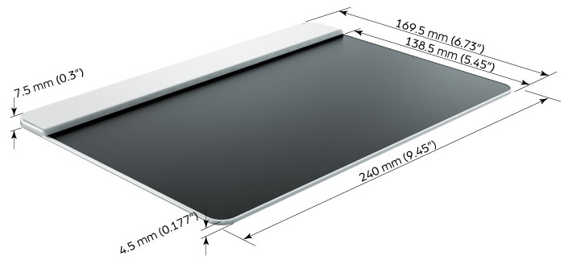

Thickness measurements are with the rubber feet. Subtract 0.75 mm for thickness measurements without the rubber feet.

## Overlays

The Overlays are the modular interfaces that are placed on the Morph and change how the hardware responds to inputs. There are eight (8) magenets on each overlay that hold the overlay in place and identify the overlay to the microcontroller firmware. Visit the Sensel [video page](http://sensel.com/pages/video) to watch videos that explain many of the overlays in depth.

### QWERTY
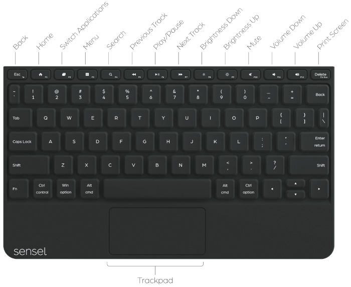

The QWERTY Overlay works like a regular QWERTY keyboard. It's great for using the Morph as a keyboard for iPads and other tablets. You will need to configure it for your Operating System using the Sensel App.

The [AZERTY](https://en.wikipedia.org/wiki/AZERTY) and [DVORAK](https://en.wikipedia.org/wiki/Dvorak_Simplified_Keyboard) Overlays provide access to more internationally-used keyboard layouts.

### Piano
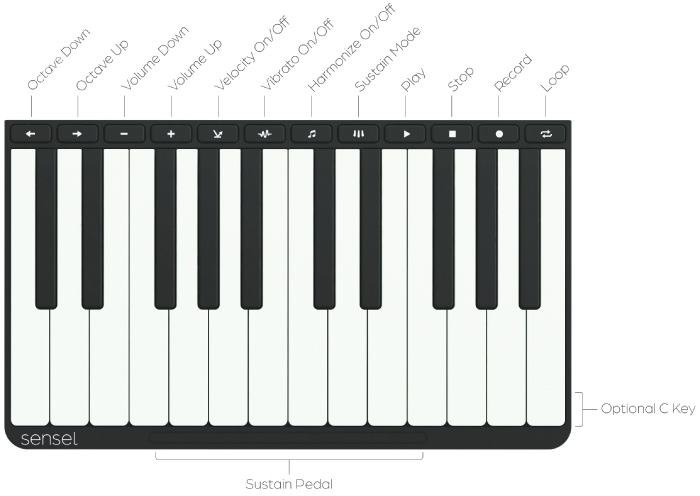

The Piano Overlay sends MIDI data on Channel 1 from the Morph to your device so you can play software synths and samplers. By default, the Piano Overlay sends notes on MIDI channel 1 and the default octave starts at note 60 (C3<sup>[1](#piano-fn1)</sup>). You can transpose up and down two octaves with the arrow keys. Additionally, you can create vibrato by moving your fingers side-to-side, bending the note.

The play, stop, and record buttons send MIDI Machine Control (MMC) commands to enable those features. Some software products, such as Ableton Live, do not recognize MMC, so they will seem to not work in those cases.

Since there is no standard MMC message for "loop," the loop button sends a MIDI note, allowing you to use software MIDI latch (or learn) to use it to control the Loop function in your software.

<a name="piano-fn1">1</a> - MIDI notes conventionally start at note number 0, named C-2. This is not a standard, as this convention has been broken many times, but most music software today tends to call MIDI note 60 C3. 

### Drums
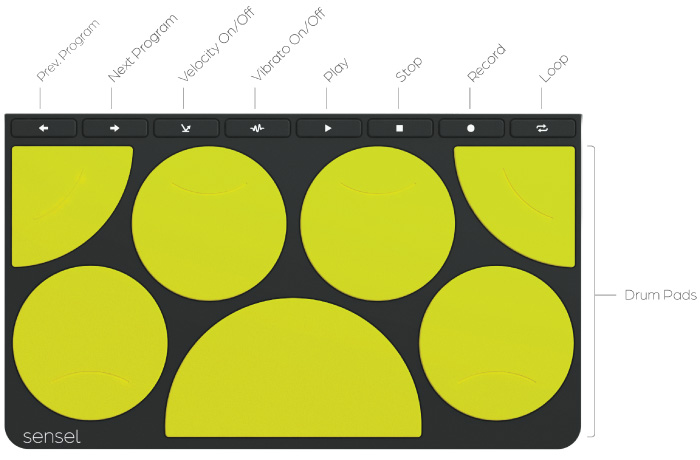

The Drum Overlay sends notes on MIDI Channel 10. The Default notes start at 36 (C3). The arrow keys transpose all notes up or down 16 semitones to better work with many software drum machines, which work in banks of 16 notes.

The play, stop, and record buttons send MIDI Machine Control (MMC) commands to enable those features. Some software products, such as Ableton Live, do not recognize MMC, so they will seem to not work in those cases.

### Music Production
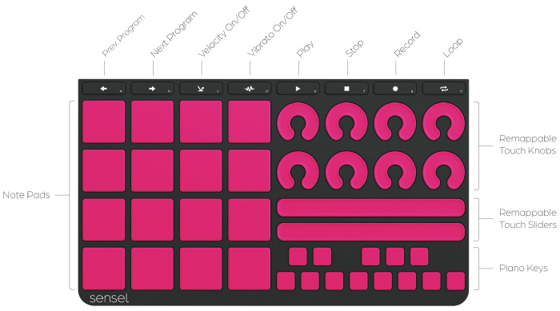

The 16 Pad grid sends on MIDI Channel 2, the controls send on MIDI Channel 2, the "piano keys" send on MIDI Channel 3.

The play, stop, and record buttons send MIDI Machine Control (MMC) commands to enable those features. Some software products, such as Ableton Live, do not recognize MMC, so they will seem to not work in those cases.

### Video Editing


#### Overview

The Video Editing Overlay is a control surface that sends keyboard and mouse events to enable professional video editing.

#### Setup

By default, the Sensel Morph works with Adobe Premiere on Windows. For Premiere on macOS, the macOS Sensel App contains the macOS mapping which can be sent to the Morph. Open the Video overlay in the Sensel App and click the "Send Map to Morph" button to send the Map. 

If you require a specific mapping for your program, you can use the Sensel App to create your own mappings for each program.

If you are using Premiere CC, you may need to add a keyboard shortcut in Premiere to change focus to the timeline panel, which has been removed in some versions. By default, the Sensel Morph will send Shift+3 when you click the timeline button. 

No driver is required for the Video Editing Overlay.

#### Controls

##### Jog Wheel and Navigation Controls

The central Jog Wheel and surrounding navigation controls serve as the primary means of moving along a video timeline. 

The Jog Wheel moves one frame for each of the eight detents around the knob. You can modify the speed of the jog wheel by pressing the modifier keys.

The Shuttle Buttons are pressure sensitive buttons that repeatedly press a key at different pressure levels, allowing you to shuttle quickly along the timeline. When you release the Shuttle Button, a halt key is sent. In Premiere, J or L is sent as you push on the Shuttle Button and K is sent when you release the Shuttle Button.

The Video, Audio, and Zoom sliders all send key events as you move along the slider. In Premiere, the sliders adjust the size of the video, audio, and zoom of the timeline elements. 
The Navigation Slider is a slider that sends scroll events for moving along the timeline. In Premiere, the timeline requires you to click on the timeline before you can scroll. The Navigation Slider is not remappable.

The other buttons in the central navigation area all send key events that are used to move through the timeline.

##### Jog Wheel Modifiers

The Jog Wheel Modifiers change the function of the Jog Wheel while you hold down the buttons. By default, these modifiers are set to Slip, Slide, and Nudge in Premiere and can be customized using the Sensel App.

##### Other Control Buttons

The rest of the control buttons on the Video Editing Overlay send key commands that can be customized using the Sensel App. 

### Gaming
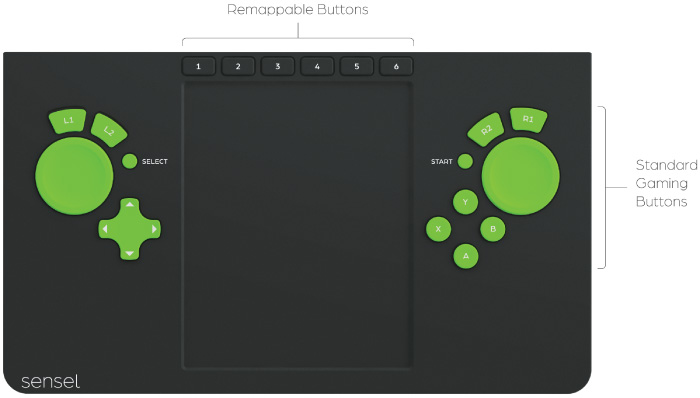

The Gaming Overlay converts the Morph into a game controller. Based on popular controllers, the Gaming Overlay has all the controls you need to play games.

The Gamepad Overlay sends standard Human Interface Device (HID) gamepad events to your computer or smartphone. While most _devices_ support this standard, not every _game_ does. To bridge this gap, emulators can be used to change HID gamepad events to events that the game can understand, such as XBox controller, Playstation Dualshock, or keyboard events.

#### Customizing

If the buttons on the overlay don't perform the right action in the game, use the [SenselApp](#gamepad-overlay) to customize the event values.

#### Emulating

For other cases, you can use software to emulate controllers.

##### Windows

USB Game Controller - comes with Windows 10. Open the USB Game Controller in Windows,  select "Sensel Morph" and click "Properties" to see the available buttons and joysticks. 

[TocaEdit Xbox 360 Controller Emulator](http://www.x360ce.com/) - software lets a controller emulate an Xbox 360 controller and customize gamepad events. [Download](files/x360ce.ini.zip) our mapping file. Unzip and put this map and the `x360ce.exe` executable file in the same directory as the game executable. 

##### macOS
The emulator [Enjoyable](https://yukkurigames.com/enjoyable/) maps HID events to joystick for game control compatibility.

##### Browsers
Some browsers support gamepad input using the Gamepad API. Gamepad support can be found on the [Can I Use website](http://caniuse.com/#feat=gamepad)

##### Bluetooth
Gamepad-over-Bluetooth will be supported in future releases.

### Art
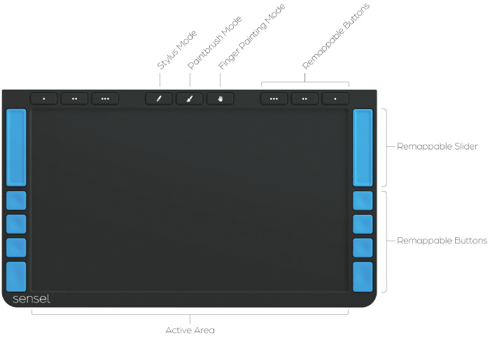

The Art overlay is more than just a new stylus. Offering several modes for drawing styles, tools, and methods, the Art overlay takes full advantage of the Morph’s powerful pressure sensors to give the visual artist new and old ways of creating digital drawings. 
Not only can the Art overlay enable the use of an arbitrary stylus (pen, pencil, chopstick, fingernail), but it also allows use of the “natural” artist tools: brushes, crayons, chalk, charcoal, and more. What's more, the Morph's 32,000 levels of pressure is vastly more sensitive than any other drawing tablet.

With the proper setup, your drawing software will adapt to brush size and orientation of the tool, letting instinct and muscle memory translate into great digital art.

#### Overview

When the Art Overlay is placed on the Morph, it shows up as a USB HID Graphics Tablet. You can press the “hand” button to immediately begin navigating your computer’s desktop and file folders. Once you open a graphics application, you can use the other modes to start creating. Any graphics software that accepts input from a stylus will work with the Art Overlay.
The top buttons stay out of the way of your drawing hand providing macros (the “dot” buttons) and mode selection.
The side buttons and slider add navigation and macro control. These are arranged symmetrically to allow for left or right hand artists. Normally, you would disable the side buttons on the dominant-hand side (to avoid an accidental trigger with a knuckle), and use the off-hand on the slider and buttons. 

#### Compatibility

* USB only.
* Mac OS 10.11 and below
* Windows 10

#### Don’t!

Don’t use a sharp object as a stylus. Silicon is prone to tearing and slicing, so you can easily damage the overlay with a sharp object. Retract your pens, and think twice about using a mechanical pencil directly on the overlay!

#### Modes

##### Pen Button - Pen Mode with Paper 
Pen mode lets you draw with real ball-point pens and graphite or colored pencils so you can use the medium and tools that feel most natural to you. Drawing on paper makes digital drawing easier to learn, since you can use the familiarity of paper to see where your strokes will be drawn, without the learning curve of most graphics tablets. For paper mode, it is wise to place two sheets of paper over the Art Overlay (a single thin sheet might let sharp pens poke through) and watch as your pen or pencil-strokes appear on the screen. The morph will act like a graphics tablet wherever it recognizes the pointy tip of a pen or pencil, so you can use it to draw in any standard drawing program. 

This mode features the Sensel Stylus Detection (a.k.a. “palm reject”) algorithm so you can rest your hand on the Morph while you draw. Paper Mode may work with a variety of drawing implements, as long as they have a relatively small and hard drawing tip. 

##### Pen Button - Pen Mode without Paper
This mode transforms the Morph into a drawing tablet. To enable paper-less drawing, check the "Use without paper" check-box in the Sensel App, and press the "Send Map to Morph" button. You can use any hard stylus-like objects such as the back of a pen or paintbrush, a retracted ball-point pen, or even a fingernail to draw using the Morph.  A light touch with the stylus will show a drawing cursor, so you can see where your stroke will begin. A harder force will start drawing the stroke. You can adjust the drawing force using the slider in the Sensel App.

##### Brush Button - Paint Mode
Paint mode brings the richness of physical media such as artists' charcoal, or conté crayons, brushes, or finger-smudging  to your drawing software. Paint mode lets you map the width, orientation, and pressure of your physical brush to properties of your digital brush. Since fingers and brushes can look much alike, this mode does not support palm rejection, so make sure not to rest your palm on the surface surface. Note that for soft brushes Paint Mode works better with no overlay on your Morph. You can set the default No Overlay mode to Paint Mode in the Sensel App. 

##### Hand Button - Touchpad mode
Touchpad mode transforms the Morph into a giant touchpad, so you won't need to carry along a mouse to interact with your art software's GUI. You can also scroll around your project using two finger swipes, right-click with a two-finger tap, or click with a firm press of your finger.

#### Buttons
All buttons are re-mappable with the SenselApp. Default behaviors provide popular controls and pan-zoom navigation.

* **Dots** - can be customised to your most frequent commands. By default, these are mapped (in order form left to right) to Undo/Redo, Step Back, Step Forward (in Adobe products), Tab, Page Up, and Page Down.
* **Top Slider** - controls zoom level in Adobe products by default. You can use the SenselApp to re-map it to change brush size, transparency, or other continuous parameters.
* **Function Buttons** - are available for your most common functions. By default these three buttons are are mapped to Shift, Command, and Option in OS X and Shift, Ctrl, and Alt in Windows.
* **Navigation Button** - is mapped to the spacebar for easy navigation in Adobe products.

<!-- 
Lightroom
GIMP
Manga Studio 
Clipstudio Paint
 -->

### Innovator


Your turn to make an Overlay! The Innovator's Overlay works with the [API](https://github.com/sensel/sensel-api). If you want to use the API with Arduino or other microcontrollers, the [Developer's Cable](https://sensel.com/collections/accessories/products/developers-cable) turns the microUSB port on the Morph into a UART connection for microcontrollers. 

Much more detail about working with the API is in our [API documentation](http://guide.sensel.com/api/).

At a higher level than the API, the [Overlay Designer](designer/) works in the [SenselApp](app/) to let you draw out and define control areas for keyboard, MIDI, game controls, mouse actions, and more. 

There is also an object for Cycling 74's [Max](http://cycling74.com), which provides much of the same data as the API, but in the Max programming environement. It is available through the Max package manager:
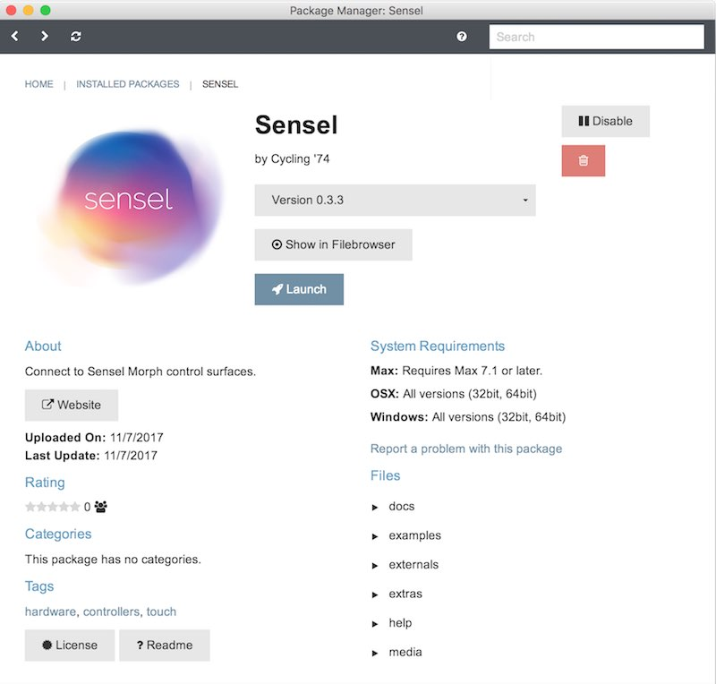

## SenselApp Software

The SenselApp is fully documented on a [separate page](app/)

## Bluetooth connection
The Sensel Morph is a Bluetooth 4.0 LE wireless device. This means it can function as a wireless controller for your music, drawing, or writing.
This section describes how to pair and un-pair your Morph to a bluetooth connection on a number of operating systems. Once the Morph is paired to your device, it will automatically connect when in range.

### Pairing

In general, the process is as follows. Screen images for different operating systems are below.

* Unplug the Morph from any USB computer connection.
* Open the bluetooth control panel for your computer.
* Hold the button down for about one second. The Morph LEDs will flash and a blue LED will turn on after three seconds.
* Click the "pair" button in your computer's control panel.
* The Morph will be paired to your device.

### Unpairing

Currently, the Morph can be paired with only one device. If you want to pair the Morph to a different device, you'll need to unpair the connected device and the Morph.

* Turn off the Morph
* Unpair or forget the Morph from the previously connected device.
* Unplug the Morph from any USB computer connection.
* Open the bluetooth control panel for the new computer.
* Hold the button down for about one second. The Morph LEDs will flash and a blue LED will turn on after three seconds.

### Switch Pairing

Once you have un-paired the Morph from the computer, you will need to enter pairing mode again.

* While the Morph is on and the blue light is on, double click the power button. The Morph lights should flash again and the blue LED will turn on after three seconds.
* Click the "pair" button in your new computer's control panel.
* The Morph will be paired to your new device.

### OS Specific Pairing Guides

Connection guides for macOS, Windows, and Linux follow.

#### macOS
Open System Preferences and click the Bluetooth icon.
Put the Morph into pairing mode. The control panel will look like:

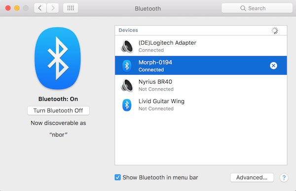

Click the "pair" button on screen. Your Morph is now paired:


#### Windows
Open the Settings panel for Bluetooth. The easy to get there is to use the Windows search bar:


Windows will find the Morph as ready to pair:


Double click the Morph listing and it will connect:

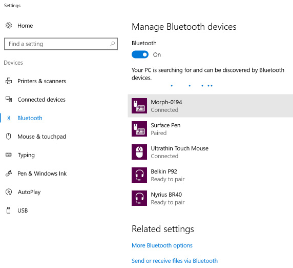

#### iOS
Open Settings and select Bluetooth. Put the Morph into pairing mode. Select Morph in the available devices and pair.


Once you have paired with the Morph, you will be able to use it with the different Overlays. Here are some sample screen captures of how it shows up  in different apps:


#### Android
Put the Morph into pairing mode. In Android's Settings app, select Bluetooth, select "Morph" from the available devices and pair:

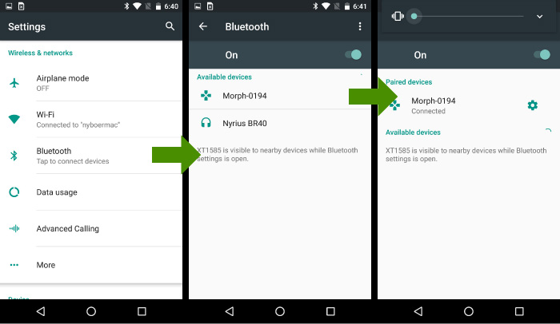

Once paired, you can use the Morph. If you are using the QWERTY Overlay, you'll probably want to setup your keyboard so you can easily switch between on-screen and Morph. Use the keyboard icon on the bottom of your screen:


#### Linux
There are many flavors of Linux. We are documenting one of the most common, Ubuntu 16.04. Open the Settings panel and select the Bluetooth panel

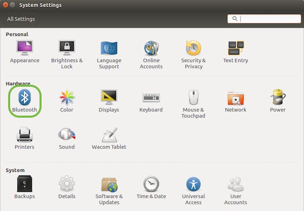

In the lower left of the "Devices" panel, click the "*+*" button to search and add the Morph.


Most Linux relies on the bluez bluetooth stack. You can also use the command line tools to pair. Once you run the `bluetoothctl devices` command, you'll be in the bluetoothctl interactive shell:

```
> bluetoothctl devices
[NEW] Controller 00:15:83:3D:0A:57 sensoruser [default]
[NEW] Device 71:11:32:B0:12:A0 Morph-0194
[bluetooth]# pair 71:11:32:B0:12:A0
[bluetooth]# pair 71:11:32:B0:12:A0
[bluetooth]# connect 71:11:32:B0:12:A0
[bluetooth]# trust 71:11:32:B0:12:A0
```
If you want to disconnect, you can
```
bluetoothctl remove 71:11:32:B0:12:A0
```
##### Update bluez
If you want to update to the latest bluez software, you can get the link from the [bluez site](http://www.bluez.org/download/). At the time of writing, the current version is 5.44. This has some support for Bluetooth MIDI:
```
sudo apt-get update
sudo apt-get install -y libusb-dev libdbus-1-dev libglib2.0-dev libudev-dev libical-dev
cd ~/Downloads
wget http://www.kernel.org/pub/linux/bluetooth/bluez-5.44.tar.xz
tar xvf bluez-5.44.tar.xz
cd bluez-5.44
./configure
make
sudo make install
```

While we can't explicitly support all Linux, this should at least get you started.

#### Bluetooth MIDI configuration
If your operating system supports MIDI over Bluetooth, you can have a wireless MIDI controller.

##### macOS


Open the AudioMIDI application in macOS. Open the MIDI Studio window (cmd-2) and double-click the Bluetooth logo. If you have successfully [paired the Morph with Bluetooth](#os-specific-pairing-guides), you'll see your device listed here. Press "connect" and the Morph will be available to any MIDI applications as an input device.

##### Windows
Windows 10 Anniversary Edition and after support Bluetooth MIDI, so make sure you have the latest update. This support, however, is limited to applications that use the UWP MIDI API (or the Win32 wrapper for UWP MIDI) (read more details [here](https://blogs.windows.com/buildingapps/2016/09/21/midi-enhancements-in-windows-10/#azm4tjkjLF8sj0el.97)). As a result, for common use, you might need a couple additional pieces of software:

* [MIDIberry](https://www.microsoft.com/en-us/store/p/midiberry/9n39720h2m05)
* [loopMIDI](https://www.tobias-erichsen.de/software/loopmidi.html)

The loopMIDI application creates virtual (or **loopback**) MIDI ports. MIDI berry provides a connection between the Morph's Bluetooth MIDI ports and the virtual MIDI ports. In your music application, you connect to the virtual port created in loopMIDI. Screenshot examples below show loopMIDI with the virtual port, MIDIberry with the connection made, and a couple of applications using the vitrual port to get MIDI input from the Morph.

* virtual port "MorphMIDI Port" created in loopMIDI (type in the field, then click "+")


* connection between Morph bluetooth and "MorphMIDI Port" made in MIDIberry (just tap on an input port and an output port to connect them)
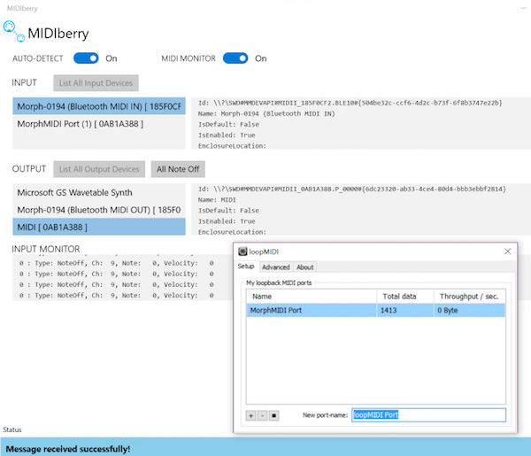

* virtual port "MorphMIDI Port" selected in the MIDI setup prefs of Bitwig Studio
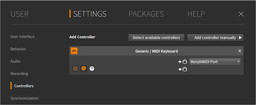

* virtual port "MorphMIDI Port" selected in the MIDI setup prefs of FL Studio


##### iOS
iOS version 8 and above support Bluetooth MIDI. These devices have Bluetooth LE support:

* iPhone 4s +
* iPad3 +
* iPad Mini +

Once the Morph is paired with the iOS device, it's available as a MIDI device to most iOS MIDI-capable apps. You'll need to go into an app's preferences or setup panel to enable and configure MIDI control.

In some cases, you may need the [midimittr app](https://itunes.apple.com/us/app/midimittr/id925495245?mt=8) to create a connection with the Morph which will expose the Morph's MIDI input to other apps.

##### Android
Android version [Marshmallow (6) and above](https://www.midi.org/articles/android-midi-in-marshmallow) support BLE MIDI. However, some devices support this connection type, and some don't. The best way to find out is to pair your device with the Morph via Bluetooth, then use the free [MIDI BLE Connect](https://play.google.com/store/apps/details?id=com.mobileer.example.midibtlepairing&hl=en) app from the Google Play store. Open it after paring the Morph to your Android device. If there is a connection to be found, MIDI BLE Connect will scan and find it.

##### Linux
BLE MIDI has some support in the latest [bluez](http://www.bluez.org) stack, and should have more complete support in future updates according to [this blog](https://blog.felipetonello.com/2017/01/13/midi-over-bluetooth-low-energy-on-linux-finally-accepted/). You are welcome to experiment! Instructions for updating to the most recently release of bluez are [above](#update-bluez).

## Use it!
As the name implies, there are a lot of different ways to use the high-resolution sensor that is the Morph. What follows in this section are the nuts and bolts on getting your morph working with your device and making use of the different Overlays in different softwares.

### Test it!
Because the Morph is capable of so many different modes and protocols, you may need some reassurance and ways of testing. Here's some tools and suggestions for some of the different modes.

#### MIDI
If you are unsure that your Morph is properly connected and providing MIDI input to your computer, you can test with some simple programs. If you don't know what MIDI is, it's a simple serial protocol that electronic music hardware and software uses to interoperate. Learn more [at wikipedia](https://en.wikipedia.org/wiki/MIDI).

##### macOS
* [MIDI Monitor](https://www.snoize.com/MIDIMonitor/)

##### Windows
* [MIDIberry](https://www.microsoft.com/en-us/store/p/midiberry/9n39720h2m05)

Bluetooth MIDI is available on Windows 10 Anniversary Edition, so make sure your version of Windows 10 is recently updated. It is limited to apps that use the native Windows MIDI implementation, so it probably won't show up as a MIDI input in most software.

MIDIberry provides native MIDI hooks to Windows 10, so it can connect to the USB MIDI and the Bluetooth MIDI ports created by the Morph. MIDIberry provides a monitor function that makes it easy to confirm MIDI data input from the Morph.

##### iOS
* [MIDI Wrench](https://www.crudebyte.com/mobile/midi_wrench/)

##### Android
* [USB MIDI Monitor](https://play.google.com/store/apps/details?id=com.extreamsd.usbmidimonitor&hl=en)

##### Linux
* [amidi](https://linux.die.net/man/1/amidi)
* [others](https://freesoftwaremusic.wordpress.com/2015/03/29/midi-monitors/comment-page-1/)

If you want a GUI monitor, you can find something in the "others" link above.
The easiest way to test on Linux is to use ALSA's `amidi` in a terminal. Plug in the Morph to your computer's USB port, then list the MIDI devices with:
```
amidi -l
```
You'll get something like
```
Dir	Device		Name
IO	hw:1,0,0 	Sensel Morph MIDI 1
```
Armed with the portname, you can now start dumping MIDI input to the terminal:
```
amidi -d -p hw:1,0,0
```

#### QWERTY
Open text editor or word processing program. Try typing. Use command and option keys. Everything work? If not, you'll need to either check your connection, or use the Sensel App to make sure your QWERTY Overlay is configured for your OS.

### Software Setup
Documentation for setting up the Sensel Morph with several popular music and art software titles is on a [separate page.](/morph_software)

## API
There's a software API for Python, Processing, and C/C++. Find out more [at our github](http://github.com/sensel).
