## Music Software Guides
For the most part, when the Morph is used as a MIDI device, it shows up like any other MIDI keyboard or controller. However, there are some details worth documenting, since, with default mappings, each Overlay sends on a different channel. Before you proceed make sure you have a wired or wireless connection between your device and the Morph.

The below screenshots show the Morph used as a Bluetooth MIDI device, but the general instructions do not change for the wired case or for different operating systems.

### Ableton Live

Open the Preferences window in Ableton Live and select the MIDI tab. If you just want to play the keyboard and drums, turn "Track" on for the input port. If you want to use controls and buttons for parameters and switches in Live, turn "Remote" on for the input port. At this time, there is no MIDI control of the Morph, so there is no need to activate "Track" or "Remote" for output.

In Ableton Live, you can filter MIDI input on tracks according to Channel. You may want to do this to ensure different Overlays are dedicated to different tracks.

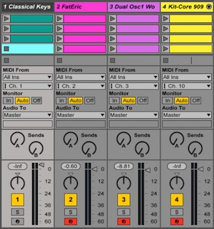

### Ableton Live Control Surface
Using our control surface script, the Morph and the music Overlays can provide automatic effect mappings and remote control over features in Live 10 to extend your productivity. Not only can you play instruments, but you can control effects on different tracks, use pressure to add send effects, launch clips, overdub, and more. 

#### Video Tutorial
A complete video tutorial that covers all the below is available on [our YouTube channel](https://youtu.be/WwEsItppiiY).

#### Download, Install, & Setup

The script will work with Ableton Live version 10. Live 9 is not supported.

Download the script from the [Sensel web store](https://sensel.com/collections/sound-packs/products/ableton-live-remote-script-pack). You'll need to checkout the digital download, which is available from the store and email:
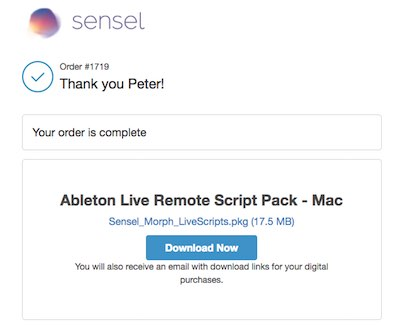

Run the installer for Mac or Windows. This will install:

__Example Live set with sounds and instruments:__

* **Mac:** ~/Documents/Sensel Morph/Ableton Live Script Project/Sensel Live Remote Script Demo.alp 
* **Windows:** {userdocs}\Sensel Morph\Ableton Live Script Project\Project\Sensel Live Remote Script Demo.alp 

__Overlay maps for SenselApp:__

* **Mac:** ~/Documents/Sensel Morph/Overlay Maps/
* **Windows:** {userdocs}\Sensel Morph\Overlay Maps

__Remote Scripts for Live:__

* Windows: C:\ProgramData\Ableton\Live 10\Resources\MIDI Remote Scripts
* Mac: Applications/Live 10/Contents/App-Resources/MIDI Remote Scripts

Notes: 
* if you want to verify the install for Mac, you can right click on the Live 10 application icon and "Show Package Contents" and navigate to the "MIDI Remote Scripts" folder.)
* On Windows, make sure Ableton is installed in C:\ProgramData\Ableton. If you have it installed in a non-default location such as C:\Program Files\Ableton, the installer will fail.

Open the Preferences window in Ableton Live and select the MIDI tab. Select the Sensel Morph as your Control Script. Select the Morph as the input and output device for the Control Surface. You will also want to enable the Morph for Track and Remote input.

<!--

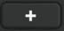

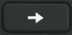

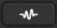
-->

#### Flash The Morph with Maps

The music Overlays will need to flashed with the Overlay maps provided by the installer. Open the SenselApp (available on our [downloads page](https://sensel.com/pages/support/#downloads)) and import the maps from your Documents/Sensel Morph directory:

For each Buchla Thunder, Drum Pad, Music Production, and Piano overlay map, select each map on the left hand panel of the SenselApp and press the top-right "Send Map To Morph" button. 

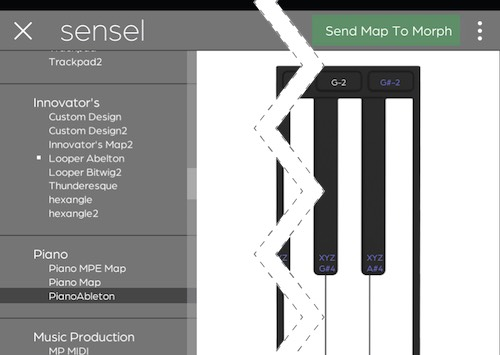

#### How to Use It

We've re-mapped many of the top buttons on the Music Overlays to better match specific functions in Ableton Live. We've also added a "Shift" button - hold it down to access additional functions for the knobs, pads, and buttons.

Top button functions:

*  select (and auto-arm) track to left of current track
*  select (and auto-arm) track to right of current track
*  transpose piano keys down octave (piano overlay only)
*  transpose piano keys up octave (piano overlay only)
*  use pressure to control Send A dial on current track
*  use pressure to control Send B dial on current track
*  start playback
*  stop playback
*  enable overdub to record into MIDI clip
*  shift - like "shift" on a typing keyboard - hold down to enable shift functions 

Top button shifted functions:

*  move session view box left
*  move session view box right
*  --
*  --
*  release after pressing shift to set Send A value
*  release after pressing shift to set Send B value
*  --
*  stop clip on current track
*  record track

Additional shift functions

* launch clips
* transpose drum rack
* transpose small keys on music production overlay
* user-assign knobs and sliders on music production overlay

Use the following illustrations as references for the functions in the script. 

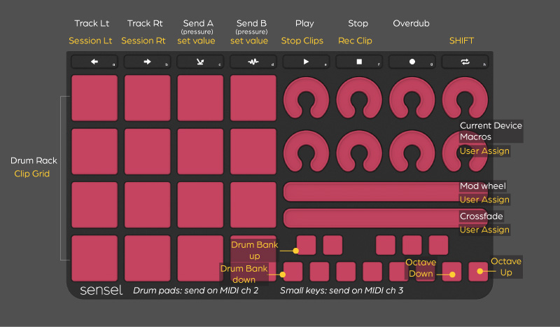

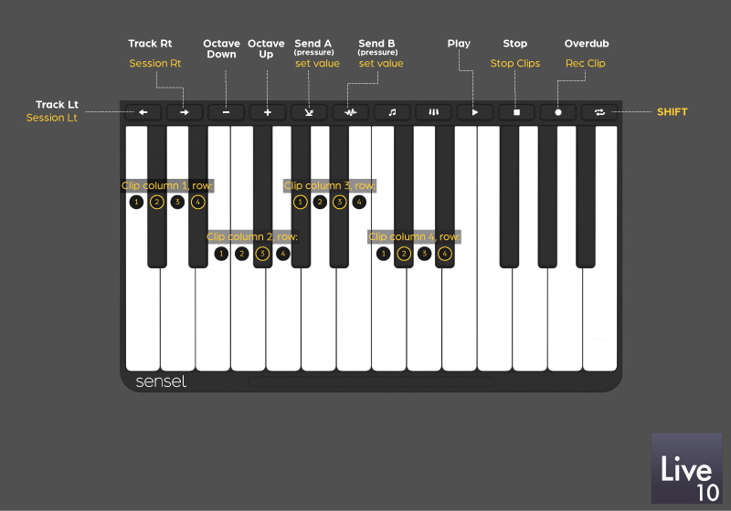

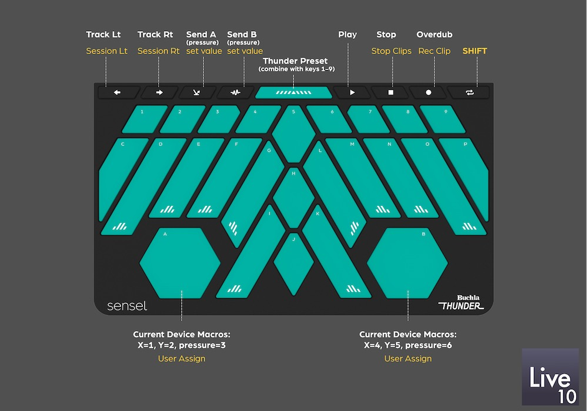

Source code for this script is available on our [GitHub site](https://github.com/sensel/sensel-controller-scripts)

#### Using Different Overlays

You can dedicate an Overlay to a particular track or tracks in Live by restricting the channel. Each overlay sends its MIDI data on a different MIDI channel, so you can simply select the appropriate channel for a track:

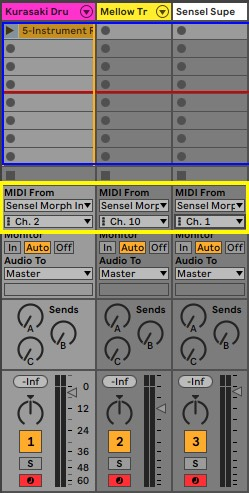

### Bitwig Studio
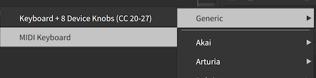

Open the Preferences window in Bitwig Studio and select the Settings, then Controllers tabs. Select "Generic" (though the Morph is anything but generic!), then choose either "MIDI Keyboard" or "Keyboard + 8 Device Knobs".

The *MIDI Keyboard* option makes it easy to play notes in any of the instruments. If you want to map the extra CC controls of the Music Production Overlay to different parameters in Bitwig, you can use Bitwig's MIDI learn feature in the Mappings Browser Panel.

The *Keyboard + 8 Device Knobs* will make the Music Production Overlay nicer to work with. You can use the Sensel App to remap the knobs to CC values 20-27, and Bitwig will automatically map the eight knobs to the currently selected Device Macros.

In this setup, both options have been added as Controllers, though only one is active.
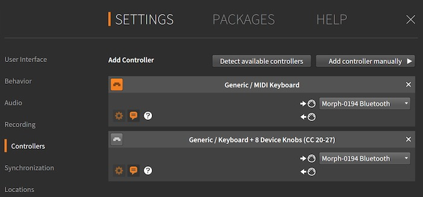

Note that it is not possible to filter MIDI Channels in Bitwig tracks. If you want to do more advanced filtering and controls, you can use Bitwig's Controller Scripting API and create a control script.

### Bitwig Studio Control Surface
Using our control surface script, the Morph and the music Overlays can provide automatic effect mappings and remote control over features in [Bitwig Studio](http://bitwig.com) to extend your productivity. Not only can you play instruments, but you can control effects on different tracks, use pressure to add send effects, launch clips, overdub, and more. 

This script is fully compatible with MIDI Polyphonic Expression (MPE) and regular MIDI, making it easy to integrate expressive play into your Bitwig compositions.

#### Video Tutorial
A complete video tutorial that covers all the below is available on [our YouTube channel](https://youtu.be/KAgfnqv8XjE).

#### Download, Install, & Setup

The script will work with Bitwig Studio 2 and above, including Bitwig Studio 8-Track.

The scripts are included in the Bitwig Studio distribution, and there is no need to install them. If there is an update, it can be found on the [github site](https://github.com/sensel/sensel-controller-scripts).

You will need to install the Overlay Maps and example set. You can download this installer from the [Sensel web store](https://sensel.com/products/bitwig-control-surface-script). You'll need to checkout the digital download, which is available for free from the store:

Run the installer for Mac or Windows. This will install:

__Example Bitwig Studio set with sounds and instruments:__

* **Mac:** ~/Documents/Sensel Morph/Bitwig Project/Sensel Bitwig Remote Script Demo.bw
* **Windows:** {userdocs}\Sensel Morph\Bitwig Project\Project\SSensel Bitwig Remote Script Demo.bw

__Overlay maps for SenselApp:__

* **Mac:** ~/Documents/Sensel Morph/Overlay Maps/
* **Windows:** {userdocs}\Sensel Morph\Overlay Maps

Open the Preferences window in Bitwig Studio and select the Controllers panel. Select the Sensel Morph as your Control Script. The Morph will be automatically detected as the input and output device for the Control Surface. 

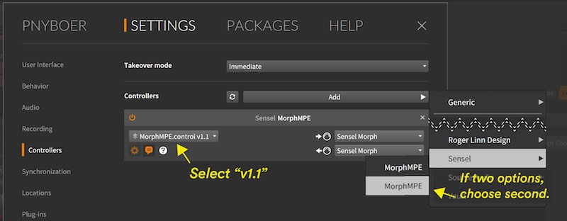

#### Flash The Morph with Maps

The music Overlays will need to flashed with the Overlay maps provided by the installer. Open the SenselApp (available on our [downloads page](https://sensel.com/pages/support/#downloads)) and import the maps from your Documents/Sensel Morph directory:

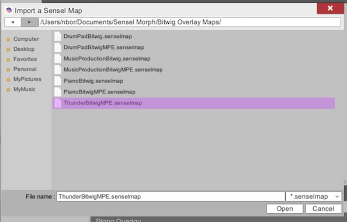

For each Buchla Thunder, Drum Pad, Music Production, and Piano map, select each map on the left hand panel of the SenselApp and press the top-right "Send Map To Morph" button. 

The maps are very similar to the standard MPE maps for each overlay, however the top buttons are mapped to different notes and controllers to allow for dynamic integration.

#### How to Use It

We've re-mapped many of the top buttons on the Music Overlays to better match specific functions in Bitwig Studio. We've also added a "Shift" button - hold it down to access additional functions for the knobs, pads, and buttons.

Top button functions:

*  select (and auto-arm) track to left of current track
*  select (and auto-arm) track to right of current track
*  transpose piano keys down octave (piano overlay only)
*  transpose piano keys up octave (piano overlay only)
*  use pressure to control Send A dial on current track
*  use pressure to control Send B dial on current track
*  start playback
*  stop playback
*  enable overdub to record into MIDI clip
*  shift - like "shift" on a typing keyboard - hold down to enable shift functions 

Top button shifted functions:

*  move session view box left
*  move session view box right
*  --
*  --
*  release after pressing shift to set Send A value
*  release after pressing shift to set Send B value
*  --
*  stop clip on current track
*  record track

Additional shift functions

* launch clips
* transpose drum machine
* transpose small keys on music production overlay
* user-assign knobs and sliders on music production overlay

Use the following illustrations as references for the functions in the script. 

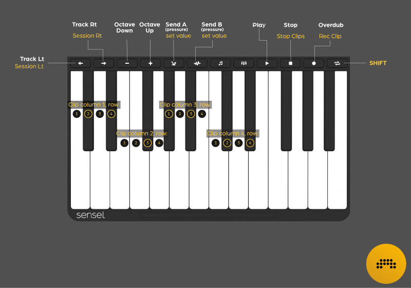

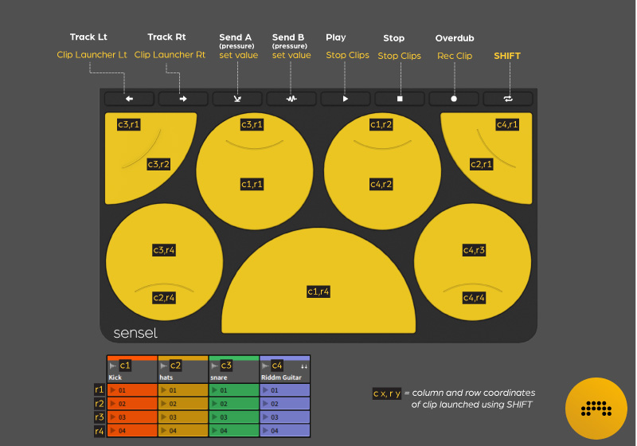

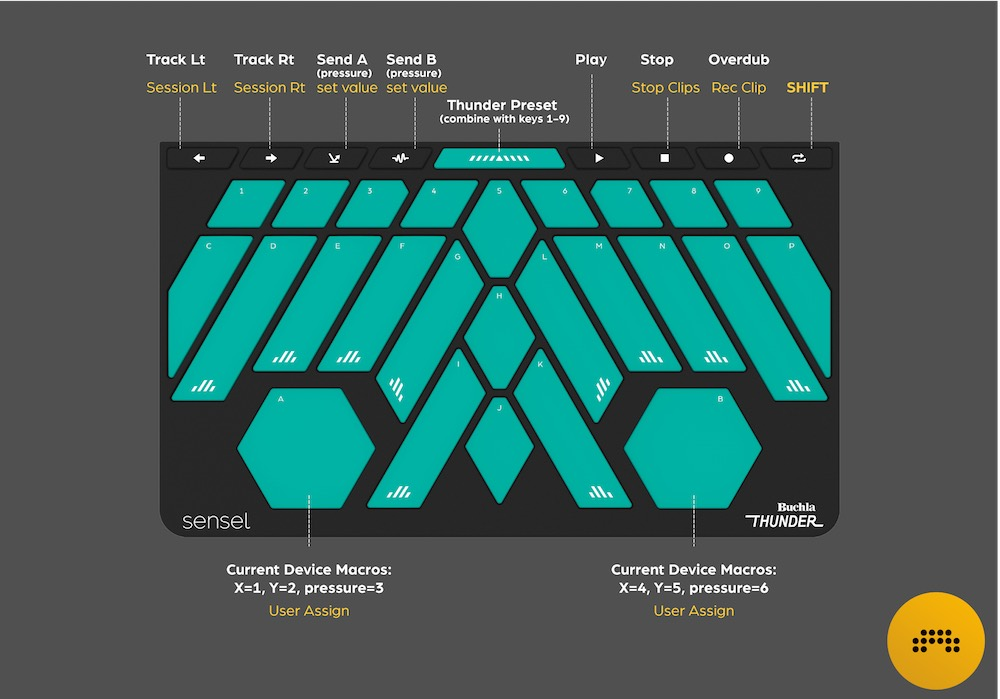

Source code for this script is available on our [GitHub site](https://github.com/sensel/sensel-controller-scripts)

#### Using Different Overlays

The Sensel Bitwig Studio controller script supports all the music overlays for the Morph: Piano, Drum Pad, Music Production, and the Buchla Thunder.

It is possible to dedicate a particular overlay to a subset of the tracks in your project. This means you can swap overlays on the Morph, and have each overlay dedicated to a particular track or instrument. Of course, each track will need to be armed for recording.

A complete guide is on our [YouTube channel](https://youtu.be/BwuK5HOGsuw), or you can read below.

First, you'll need to enable the exclusive port for the overlays you want to use for a dedicated track. This is done in the *I/O panel*, which is visible when you click the arrows in the bottom right of the Bitwig Studio window:

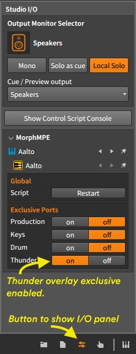

Then, you can select the overlay from the track inputs to restrict that track to only listen to the selected overlay:

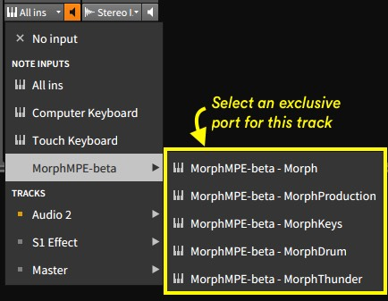

IMPORTANT: If you do not have an exclusive port enabled for an overlay, and you assign a track that exclusive port, you will get no input from your Morph on that track. In other words, if you assign a track an overlay-specific port, make sure it is enabled in the Studio I/O panel!

### FL Studio
FL Studio works with both Windows and Mac operating systems.

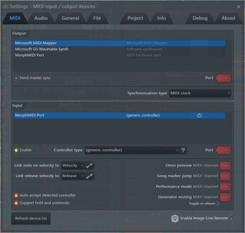

Open the MIDI Settings window from the Options menu.

Select the Morph in the input panel.

Click "enable" below the Input panel. Select a controller type "(generic controller)" from the menu.

This enables basic MIDI input for the Morph. You can get more info on using MIDI in FL Studio 12 from their documentation.

### Cycling 74 Max

Max will use any active MIDI device as an input. How you program your patch will affect what happens. The above screenshot illustrates the MIDI input selection menu that appears from double clicking on the MIDI input objects (midiin, ctlin, notein, pgmin, etc.).

#### [sensel] object in Max

You can integrate most of the API using objects in Max. This gives you a full dictionary of information about every contact on the Morph including ID, location, pressure, size, and more. The jit.sensel object provides a bitmap force image that you can use in the Jitter matrix processors or as a video input.

It's easily installed via the Max package manager. Go to the File menu and select "Show Package Manager." Search the remote packages for "sensel" to find the Sensel installer. Click install and read the helpfile.

### Apple Logic Pro X, Garage Band, and Main Stage

With Apple music applications, "it just works" is the general idea. If it shows up in AudioMIDI Setup, it will provide input to recording-armed tracks to play software synths, samplers, and drums.

If you want to add more controls for effects and synths, you can use Logic's "Learn Controls" features.

#### Logic Tutorial Video
We have a live-stream style video that goes into detail about setting up the Morph to get the most of it in Logic. This covers the topics of 
mapping knobs to instrument parameters (like filters) 
setting up mulitple MIDI map modes
setting up the music overlays for playing instruments in Logic
setting up Logic to commit overlays to specific tracks
get the most out of MPE. 

Watch this video on our [YouTube Channel](https://youtu.be/FJxfj7rDJME). The description has a linked table of contents so you can jump to the topics you are interested in.

#### Transport Controls
The default messages for the play, stop, and record buttons on the Morph overlays use MIDI Machine Control (MMC). Logic does not respond to this by default. To make it work open the preferences panel, and click on the MIDI tab:
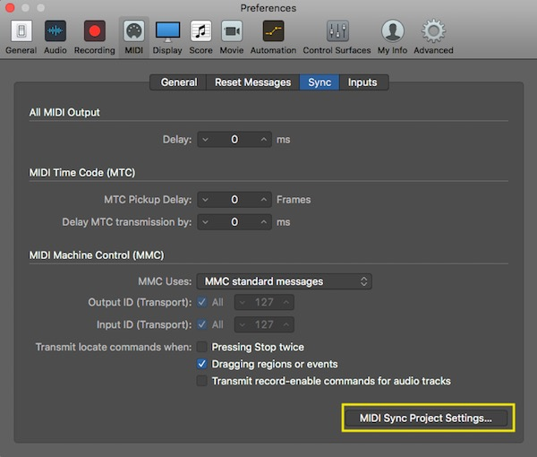
and click on "MIDI Sync Project Settings" in the lower right. 
In the new window, make sure the "Listen to MIDI Machine Control" is on.

Now your Transport buttons on the Morph will function. 

#### Oddities
Logic has some quirks that might be frustrating. Here's some workarounds. These are covered in the tutorial video mentioned above.

##### MIDI type
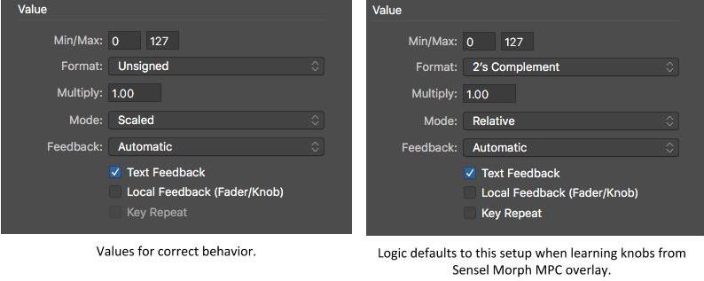

You may need to edit some values in the Expert View, since sometimes Logic will guess incorrectly about the format of incoming data. The procedure is similar for Main Stage.

##### CC Data
In some cases, you may want to exclude Control Change data from the after-pressure on the Music Production pads. For example, some synths may respond in undesirable ways to the CC data from the Pads. This is particularly noticible on some synths such as Ultrabeat and the Electric Pianos, which automatically respond to CC 43 (Expression). If you want Logic to ignore the CC data, go to the File->Project Settings->MIDI window and select the Input Filter tab. Here, you can select "Control Changes" to filter out any CC data from the Morph to Logic. This is a somewhat temporary fix, since this will keep the "dials" and sliders on the Music Production Overlay from working. Future firmware updates for the Morph will address this problem more elegantly.

Garage Band offers no remote control of parameters from MIDI devices. You can only play instruments with note and pitchbend input.

### Steinberg Cubase

Cubase works well with the Morph. You'll want to load the MIDI Polyphonic Expression (MPE) maps for your Overlays, since Cubase works well with MPE. Open your Studio Setup panel from the Studio menu. Make sure the Morph is selected in the MIDI settings area.
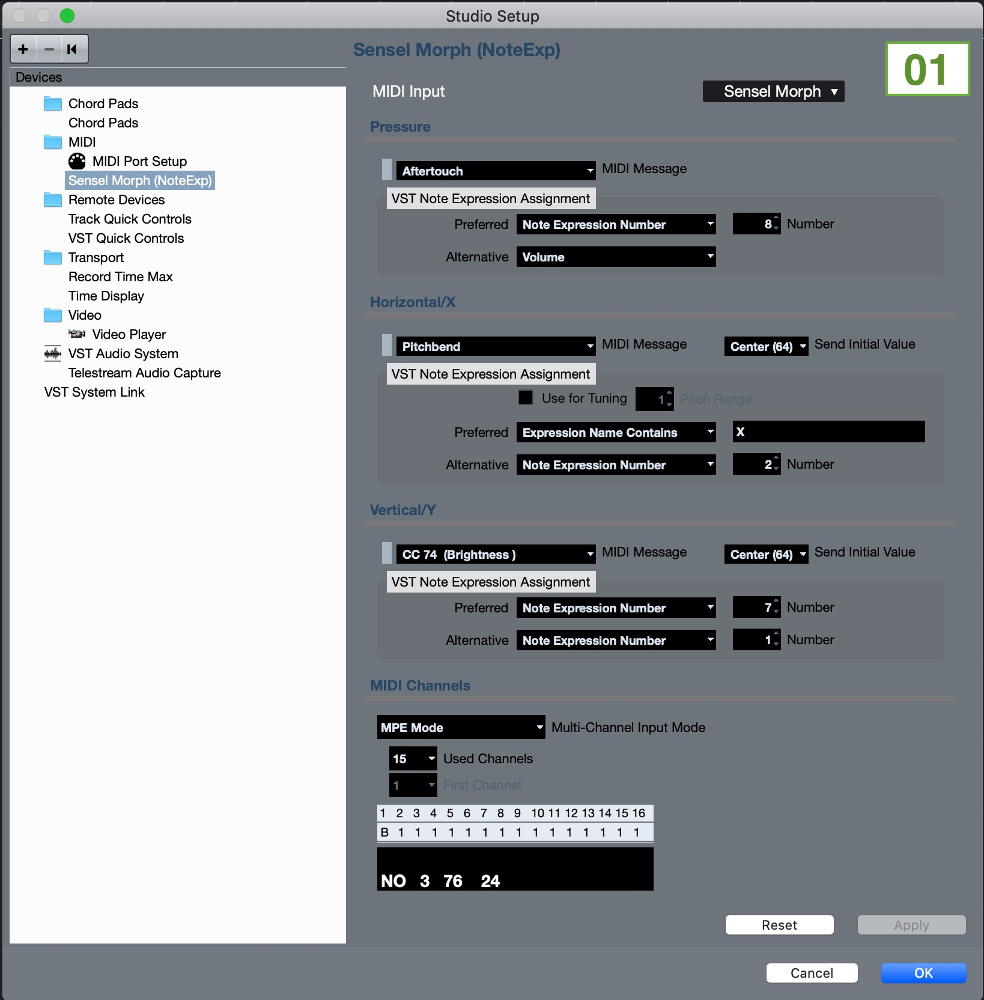
If you are using a plugin instrument, you'll want to make sure it is set to listen to MPE. For example, Audio Damage Quanta has a toggle to turn this on:
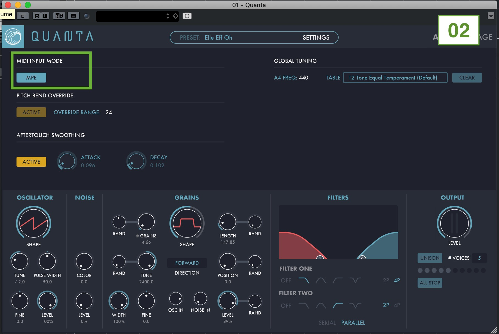
For another example, Madrona Labs Aalto has a menu to set this:
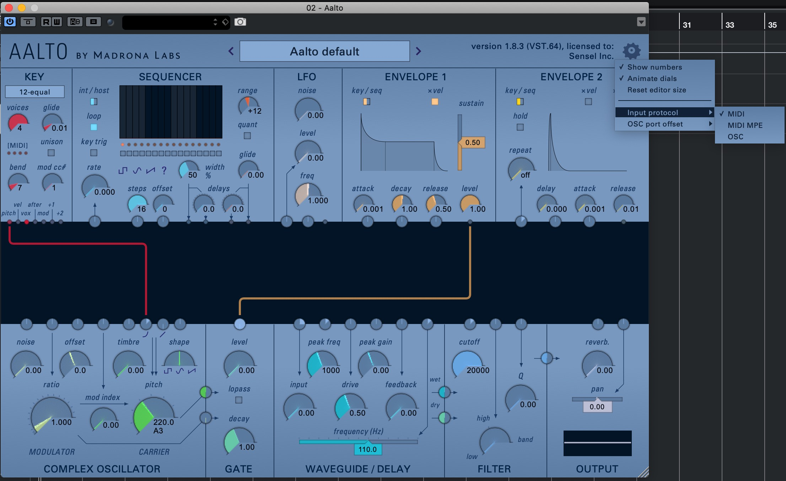
In your track settings Inspector, you'll want to make sure you have "Sensel Morph (note exp)" set as the input, and select "Any" as the MIDI Channel:
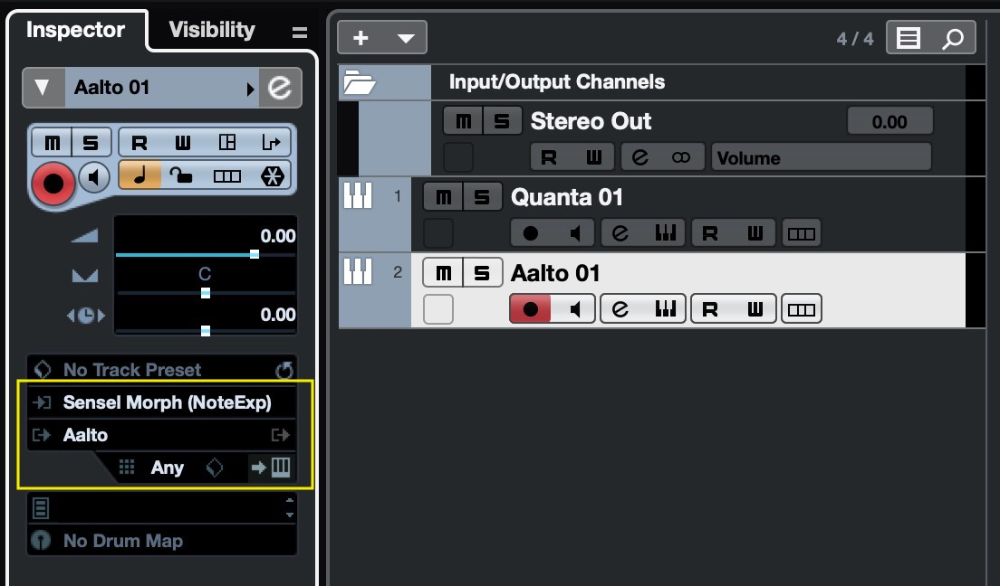

If you are using Steinberg's built in instruments such as Retrologue, you'll want to make sure the Note Expression data is passed to the Instrument. Make sure the Inspector is showing the Note Expression panel

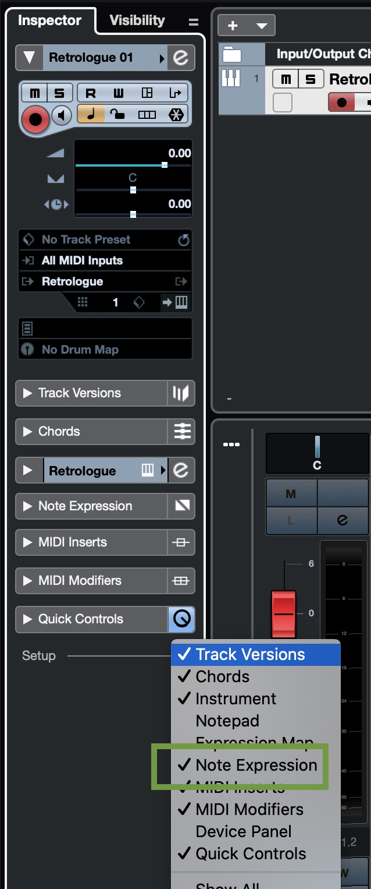

which will look like:

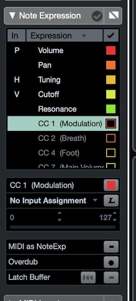

In this panel, you can select the basic expressions for X, Y, and Z that will pass through to the instrument:

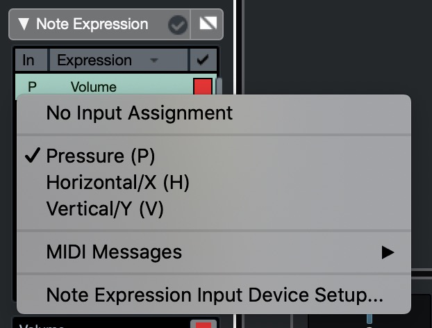

In the instrument, you can use the Modulation Matrix to select a note expression (N7 for Y directions, N8 for pressure) and use it to modulate a parameter in the synthesizer
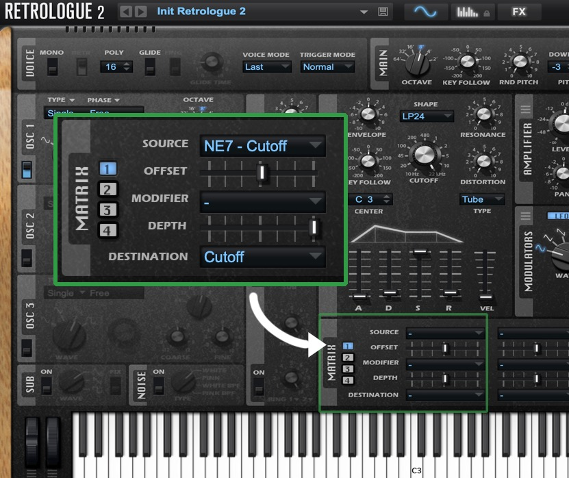

#### Video Tutorial
This is all detailed in a Live Stream tutorial we did. Cubase section [starts here](https://www.youtube.com/watch?v=2qGlx7Yjqnc&t=714s).

### Presonus StudioOne 2

Open the Presonus preferences panel and select the *External Devices* tab. Press the _"Add..."_ button to add a new MIDI controller.

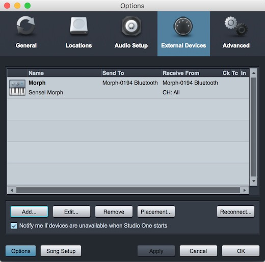

In the resulting *Edit Device* panel, you can add "Sensel" to the Manufacturer field and "Morph" to "Device Name" field. Press the _All_ button to receive MIDI on all channels. Select the Morph in the "Receive From" menu (there is no need to select the Morph in the Send To menu, since there is currently no MIDI control of the Morph).

Engage "Split Channels" if you would like to create a separate Instrument Track input for each MIDI channel from the Keyboard. You will probably want to enable Split Channels as pictured, since each Overlay sends on a different MIDI channel.

You can choose to use this Keyboard as your "Default Instrument Input" by checking the appropriate box. If you are using only one Keyboard with Studio One, you should check this box.

### Propellerheads Reason
Reason has several ways of using a MIDI keyboard or controller. The most basic is to just add the Morph as a keyboard.

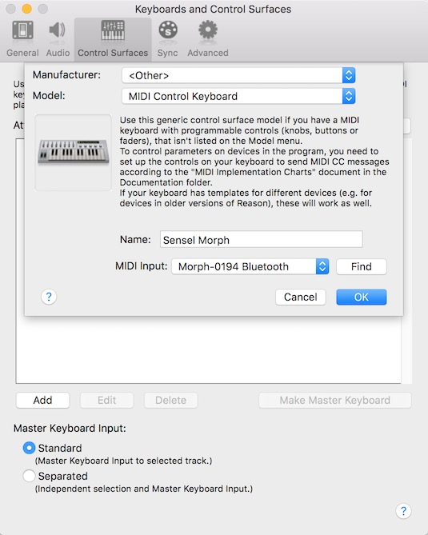

Open Reason's Preferences panel, and select the *Control Surfaces* tab. Click the _Add_ button, and select the "<Other>" from the *Manufacturer* menu and "MIDI Control Keyboard" from the *Model* menu. You can type "Sensel Morph" into the *Name* field. Finally, select the Morph from the *MIDI Input* menu.

After you have set that up, you can make a more sophisticated setup to filter channels

Select the "Sync" tab and add the Sensel Morph to at least one of the External Control Buses, as pictured above.

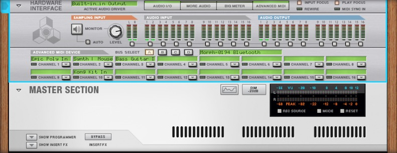

Now you can use the Hardware device in the Reason Rack and click the *ADVANCED MIDI* button to expose the selectors. It is here that you can map MIDI channels (and thereby different Overlays) from the Morph to different devices in your rack.

## Art Software Setups
The basic strategy behind setting up your software to work with the Morph is to understand what parameters come from the Morph and how to apply them to brush properties. In general, there are three dimensions that come from a USB stylus tablet: **Pressure**, **Tilt**, and **Rotation** (or Bearing). 

In Morph's unique Brush Mode, you want your software brush to adapt to the size of the brush or stylus you are applying to the Morph. This is reported on the "Tilt" channel, since traditional tablets use tilt to affect brush size. Pressure is best mapped to the brush opacity to emulate paint or ink density. Rotation is ideally mapped to brush angle when using software brushes that are non-round. 

Using the Stylus Mode, you can map Pressure and Rotation to your brushes, however, there is no Tilt reported from the Morph. 

The Sensel Morph currently supports Adobe Photoshop CC, Adobe Illustrator CC, Corel Painter 2017, recent versions of Autodesk Sketchbook, and other art programs if they support Windows Ink or the Sensel macOS Driver.  

### Corel Painter
[Corel Painter](http://corel.com) offers a vast array of options for brushes, allowing for models of oils, gels, inks, charcoal, airbrush, and more. These settings are created in the Brushes Control Panel, which has several sub-tabs for the various properties. 

The first thing you'll need to do is make sure you have the correct tablet type selected in Corel's preferences. Go to the **Edit** menu and select **Preferences**, then select the **Tablet** panel. Make sure **"RTS-compatible Device"** is selected:

Now you are ready to modify your brushes. Open the Brush control panel from the **Window->Brushes Control Panels->General** menu, or use **CTL-b**. 
As an example, you can quickly set up a brush for Morph's brush mode using:
* Dab type: flat
* Opacity Expression to Pressure
* Size Expression to Tilt
* Angle Expression to Bearing

You may also want to refine the "feel" of your brush with the Brush Tracking curves. Go to **Edit->Preferences->Brush Tracking** and follow the instructions to make a brush feel natural.

### Adobe Photoshop
[Adobe Photoshop](http://adobe.com/photoshop) of course goes beyond photo editing and provides several options for modelling different art media - airbrush, oils, watercolors, and more. 

Select the Brush tool from Photoshop's tools pallete:

Now you can open the Brush window from the Windows menu and use the Shape Dynamics and Transfer brush properties to apply the Morph's Pressure and Rotation to the brush:

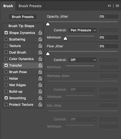

Depending on the desired effect, pressure can be applied to Opacity or Flow. 

### Adobe Illustrator
[Adobe Illustrator](http://adobe.com/illustrator)

Adobe Illustrator is a fully featured illustration program, with several different brush options and types. Depending on the chosen brush, there are different places to set up the Morph's Pressure, Rotation, and Tilt data. Below are screen caps of several places you can setup your Morph to interact directly with Brush properties. As you'll see, these options are generally found by double-clicking on the brush in the Brush Window.:

First, be aware that there are a couple different types of brush in Illustrator: the Paintbrush and the Blob Brush.

Brush selection happens in the Brush Library and Brushes windows. If the Paintbrush is selected (not Blob Brush), you can access the Brush Options from the Brush window hamburger menu:

[Adobe Illustrator](img/overlay_art_ai_brushes_opt.jpg)

Double clicking on the top brushes in the brush window opens up the Caligraphic Options:

Double clicking on an Art Brush in the brush window opens up Art Brush Options:

If the Blob Brush is selected in Illustrator's tools, double clicking on that will pull up some more options

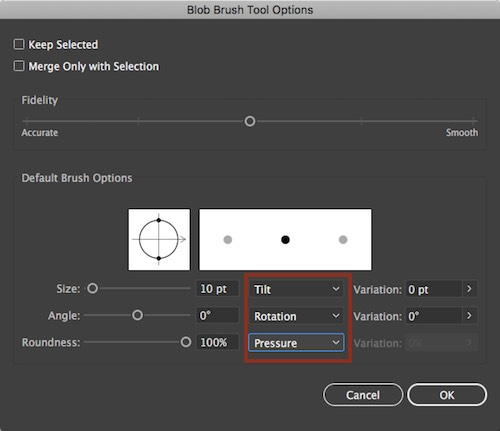

### Sketchbook Pro

For the most part, Sketchbook only responds to the Pressure and Tilt parameters from a tablet. You can create a new brush using the Circle menu in the Brush Library:

Then, double-click on the new brush (or an existing one), and modify its properties. In this example, the minimum and maximum values for size, opacity, and flow have been modified to respond to pressure. Set min and max to the same value to have the parameter unaffected by pressure.

Some brushes will respond to tilt, which the Morph uses to send stylus size in Brush Mode. You can use this parameter in some brushes to interesting effect:

