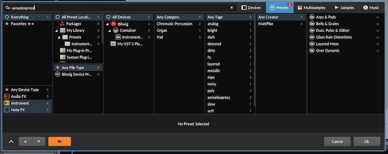
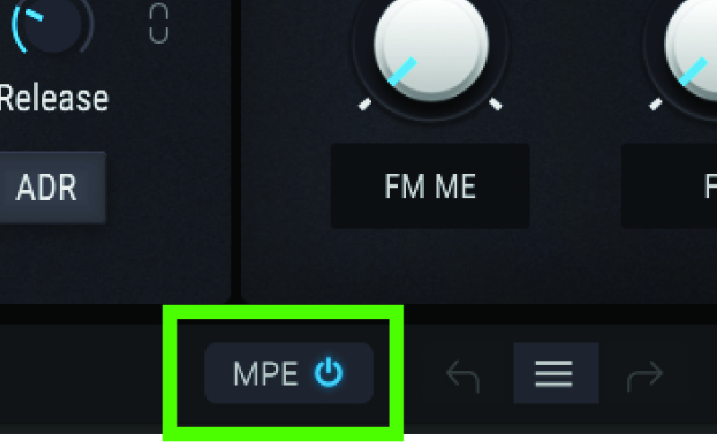
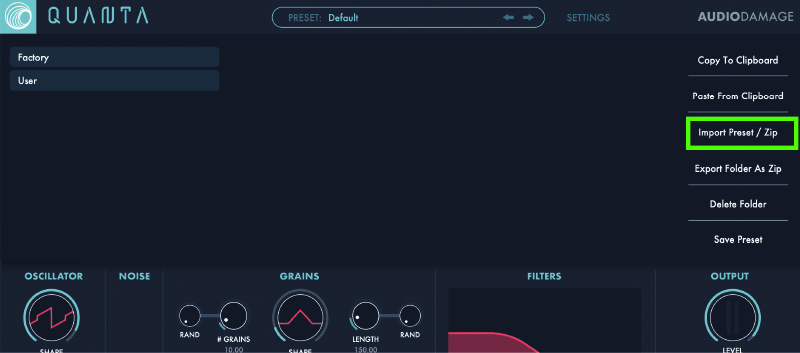
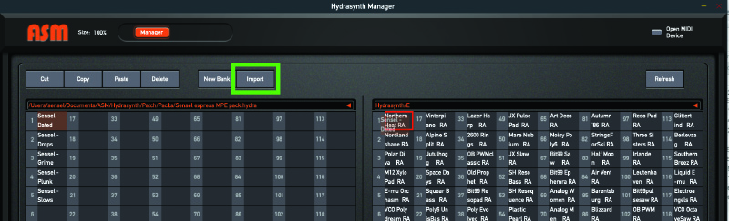
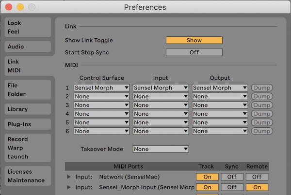

# Morph Soundpacks

There are several soundpacks developed for the Morph. Below are some setup details for several of the packs we provide.

## Techtonics

The Sensel Techtonics sound pack is designed for Ableton Live 11 and Bitwig Studio 3.3. It features nine multi-sample synths from the Moog Subharmonicon, Meeblip Geode, Buchla Music Easel, over 60 polyrhythmic loops, five drum racks of percussion and bass kits and a full kit of only kick drums.

Beyond great sounds, this kit has many creative uses of MPE. For example, the vertical "slide" gesture on the "Kits" is used to create a "rim" at the top of all the pads, when played with a 4x4 grid. This rim adds a distortion, effect, filter, or other variation to the pad.

This pack includes preset versions of all the tracks, so it's easy to incorporate into your own projects from the Live Browser.

Techtonics can be purchased from the [Sensel store](https://morph.sensel.com/collections/all/products/techtonics-mpe)

## Installation

### Live 11
Techtonics is delivered as a compressed Ableton Live Pack (.alp) file. Double click on the "Sensel Techtonics Pack.alp" file and Ableton Live will launch and ask where you want to install the files. We recommend creating a folder in your Ableton Live folder called "External Packs" and installing there:

* Mac: ~/Music/Ableton/External Packs/
* Windows: \Users\[username]\Documents\Ableton\External Packs

In Ableton Live, you can click "Add Folder..." to your "Places" so the presets can be easily found and added to other projects:

### Bitwig Studio
Techtonics is delivered as a Bitwig Project folder. Unzip the downloaded "Sensel Techtonics Pack BW.zip" and move the resulting folder to wherever you keep your Bitwig Projects. We'd recommend

* Mac: ~/Documents/Bitwig Studio/Projects/
* Windows: \Users\[username]\Documents\Bitwig Studio\Projects

You can either create preset files from the Tracks or simply drag tracks from this project to your existing project. (One of the great things about Bitwig is you can have multiple projects open at the same time!)

## Instrument Details

The different parts are arranged into Group tracks. Open the Groups to see the individual instruments on each track.

### Synths

#### Vaalbarra, Kaapvaal, Kenora, Nuna, Geoda, Magma
Turns out IKEA and supercontinent names have a lot in common! These synths sample the analog oscillators of a Moog Subharmonicon, which can achieve lovely, unusual harmonic relationships in one fat sound. Geoda samples a Buchla Music Easel Command for an atonal percussion style synth. Magma samples the unruly Meeblip Geode to ground it with polyphonic delight. MPE is implemented similarly for all: Low pass filter on Slide, minimal bend on side to side. Pressure controls the filter morph into bandpass and adds LFO pan modulation per-key for a rich stereo image.

#### Ur
The Ur synth is a one-shot monophonic bass synth. It uses MPE "slide" (up/down) to select from four layers of samples - each layer a different filter setting of the Moog subharmonicon. It is a simple but effective use of MPE.

### Drums

#### Techtonics Kits 1-5, Kicks
Kit 1 focuses on drums - kicks, hats, toms, and percussion sounds, all with a sonic variation at the top of the pad. The rest of the kits are filled with percussive sounds and basses, organized together in rows. Each row generally shares a similar effect at the top edge of the pad, and the right most pad often has a sustain when appropriate. The last kit is 16 custom kicks, each layered from several analog samples.

### Loops

Organized around the Buchla Thunder overlay, the Loops are sampler instruments that let you blend and mix long loops for composing, or just finding the perfect foundation for your track. Press harder on the Morph to double the speed and stereo spread. Of course, you can just grab any loop from the sampler zone and drop it into a clip.

#### Drift Loops
A wild assembly of polyrhythmic loops recorded from the Moog Subharmonicon at 120BPM. Everything from the minimal to the maximal, you can find the loop you need by using the Piano or Buchla Thunder overlays on the Sensel Morph. Slide up and down for filter, and press down to "push" the sound into a different octave and a send effect.

#### Crystalize Loops
Developed by gradually changing a patch, these loops are more related to each other than the Drift set. Control with MPE's Slide and Pressure gestures to find the combination you need.

#### Shift Loops
Bassy and abrupt, these loops can provide a bass foundation for tweaking out minds on the dance floor.

## express MPE
The Sensel express MPE presets are delivered as a zip file. When you download the package, unzip to your Documents/ folder. In the Sensel express MPE Presets Collection folder, you'll find folders for each synthesizer. Most of these have a folder inside named 'Sensel express MPE' that can be put in the synthesizer's preset folder. Below is a complete guide to where and how to do this for each synth.

The presets are delivered as a zip file. Simple unzip, and folders for each software instrument listed below will be inside.

### Xfer Records Serum
Xfer Records Serum:
There are a couple ways to import presets into Serum. One way is to copy the "Sensel expresss MPE" folder to the presets folder:

* Mac: /Library/Audio/Presets/Xfer Records/Serum Presets/Presets
* Windows: Documents\Xfer\Serum Presets\Presets\

If those paths are a headache, just open Serum, and visit the MENU to get to the Presets folder.

You can also load individual presets using the ‘Load Preset’ feature

Make sure your DAW’s instrument track is setup for MPE, and make sure the plugin is set to listen to MIDI MPE.

### Bitwig Studio 3.3+:
Put the Sensel express MPE folder into your Bitwig Library

* Mac: /Documents/Bitwig Studio/Library/Presets/
* Windows: /Users/(username)/Documents/Bitwig Studio/Library/Presets/

You will be able to load them by adding an instrument in your track and finding the express presets by searching for the 'senselexpress' tag:

### Arturia Pigments v2.2+:

Open Pigments either in your DAW or the standalone application. Select "Import" from the top left menu and select the 'Sensel express MPE.pgtx' file.

Select presets by going to the "Library button" and use the "Sensel express MPE" bank.

Make sure your DAW’s instrument track is setup for MPE, and make sure the plugin is set to listen to MIDI MPE on the bottom of the Pigments interface.

If you need to know, presets for Pigments are stored in:

* Mac: /Library/Arturia/Presets/Pigments/User/
* Windows: C:\ProgramData\Arturia\Presets\Pigments\

### Madrona Labs Aalto and Kaivo.
Copy the Sensel express MPE folder from the Aalto or Kaivo folder into the plugin’s preset folder.

Aalto Presets:

* Mac: /Users/(username)/Music/Madrona Labs/Aalto
* Windows: Users\(username)\AppData\Roaming\Madrona Labs\Aalto

Kaivo Presets:

* Mac: /Users/(username)/Music/Madrona Labs/Kaivo
* Windows: Users\(username)\AppData\Roaming\Madrona Labs\Kaivo

Make sure your DAW’s instrument track is setup for MPE, and make sure the plugin is set to listen to MIDI MPE.

### Audio Damage Quanta:
From the Quanta interface, click on "PRESETS" and click on "Import Preset/Zip," found on the right.

Select the zip file 'Sensel express MPE.zip' and import. This adds the presets to Quanta.

If you need to know, presets for Quanta are stored here:

* Mac: /Users/(username)/Music/Audio Damage/Quanta/User
* Windows: C:\ProgramData\Audio Damage\Quanta\

### Ableton Live 11
Double click on the .alp file in the Ableton folder of this preset collection. Ableton Live will ask where you want to install it, it's usually best to choose your Ableton Live Library. Presets are in the "Presets" folder of the installed project and should be accessible from the Live browser.

If you try to use a Preset and Live alerts you that “Media Files are Missing”, make sure you add the express MPE project folder to your Live search path in the Live Browser.

### Ashun Sound Machines Hydrasynth
Download the Hydrasynth Patch Manager from https://www.ashunsoundmachines.com/downloads
Run the Hydrasynth Manager. If your Hydrasynth is connected by a USB cable, then it will automatically connect. Otherwise, use the “Open MIDI Device” button.
Import the "Sensel express MPE pack.hydra" from this collection's Hydrasynth folder.

Select a bank on the hydra side of the manager, then drag presets to Hydrasynth bank panel.

### Credits
Most presets in the express MPE collection were designed by Matt Pike https://www.mattpikesounddesign.com/

## Sarah Belle Reid Sound Worlds
The Sound Worlds pack is a unique collection of Live Samplers and Effects that are designed to be played with the Buchla Thunder Overlay for the Sensel Morph. The pack is delivered as a zip file, and contains two Live Project folders - one for Live 10 and one for Live 11.
The Live 11 version is designed to work with MIDI Polyphonic Expression (MPE) controls, and has some bonus Sampler instruments that work with MPE. Each version has its own .senselmap file that will need to be loaded onto the Morph using the Sensel App. Learn more about this pack at https://morph.sensel.com/pages/sbrbuchla

### Live 10 vs Live 11
The Live 10 version will not work in Live 11. The main reason is that the Expression Control device is significantly different in between the two versions.

If you are working with Live 10 and the Sensel Morph, we recommend using the Live 10 Remote Script. You can get that setup using the instructions in our online guide:	http://guide.sensel.com/morph_software/#ableton-live-control-surface

There is also a Remote Script for Live 11 and MPE available on our github site:
	https://github.com/sensel/sensel-controller-scripts

In the event you are already using the Remote Script for Live 10, you’ll want to make sure you have the correct map loaded on the Sensel Morph for the Thunder Overlay.  The Remote Script is not required to play with Sound Worlds. See the following pages on how to set this up.

#### Live 10

1. Unzip the “Sound World” archive
2. Open the “Sound Worlds Live 10” folder
3. Open the SenselApp
4. Import the “Ableton Live 10 Thunder - Sound Worlds” senselmap file from the “Sound Worlds Live 10” folder and “Send Map to Morph”

    

5. Open the “Sound Worlds” Live project file
6. Use the Thunder “Preset Selector” to select Preset 9

    

7. In Ableton Preferences, select the MIDI Tab and make sure the Sensel Morph is selected as a MIDI input device for Track and Remote. If you are using the Remote Script, make sure the Morph is selected as the the Input

    

#### Live 11

1. Unzip the “Sound World” archive
2. Open the “Sound Worlds Live 11” folder
3. Open the SenselApp
4. Import the “Thunder Ableton MPE.senselmap” file from the “Sound Worlds Live 11” folder and “Send Map to Morph”. This is the same map included in the github repo for the script, so if you have installed the Live 11 Script maps on your Morph, this is not needed.

    

5. Open the “Sound Worlds” Live project file
6. Use the Thunder “Preset Selector” to select Preset 8

    

7. In Ableton Preferences, select the MIDI Tab and make sure the Sensel Morph is selected as a MIDI input device for Track, Remote, and MPE. If you are using the Remote Script, make sure the Morph is selected as the the Input

    

### Play and Explore

The Sounds are grouped with different pads on the Thunder. Pressure and location often change the sound - usually filters, arpeggiation speed, pitch shift, and effects. It varies, and is up to you to discover. Enjoy!

### Credit

* Sound and Interaction Design: Sarah Belle Reid - [website](https://www.sarahbellereid.com/)
* Technical Support and Documentation: Peter Nyboer - [website](https://nbor.us/)
